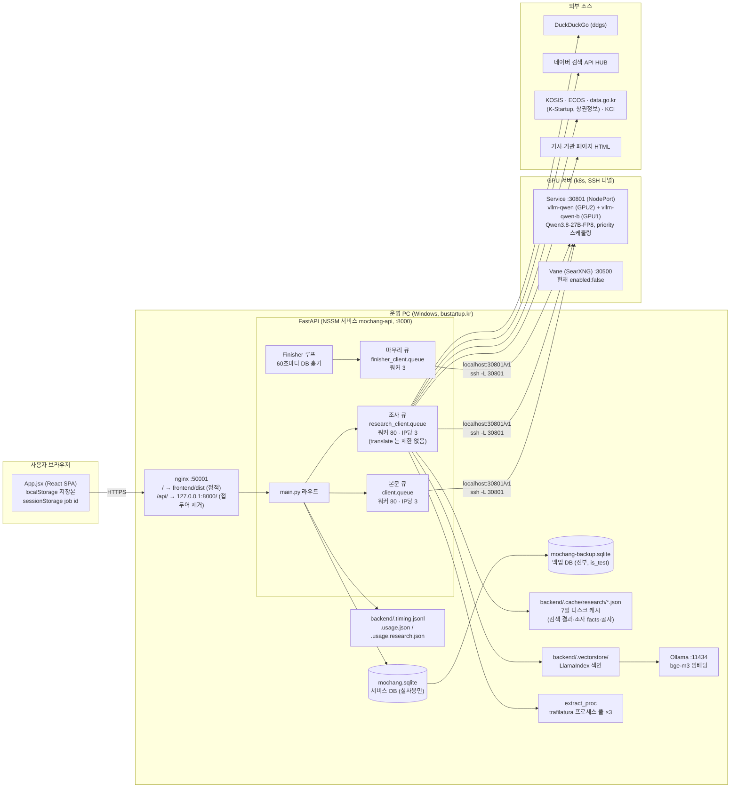
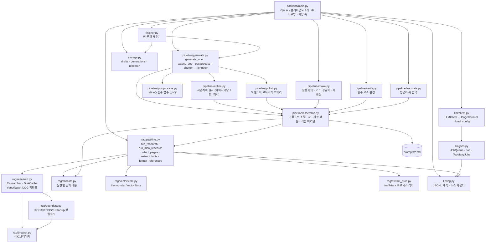
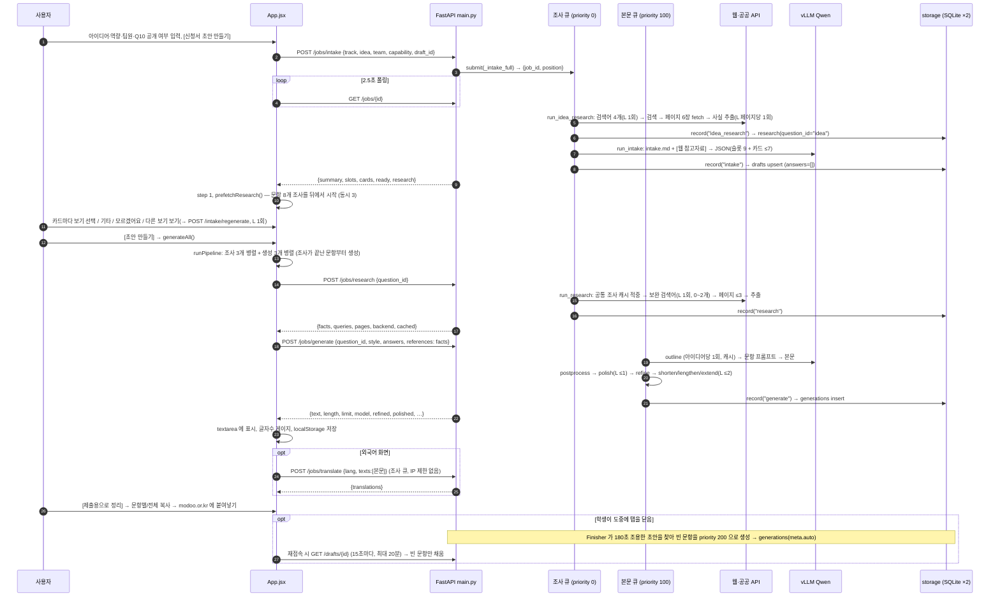

# 모창봇 시스템 구조도 — 코드 단위 전체 해설

> 작성일: 2026-09-04 (브랜치 `llama-switch-and-diagnostics`). 같은 날 오후의 보강(접근 열쇠·상한 개편·신선도·가시화 — §22 마지막 행)까지 반영.
> 이 문서 하나로 저장소 전체(백엔드·프론트·프롬프트·DB·큐·조사·배포·테스트)를 파악할 수 있게 쓴 해설이다.
> 코드 인용은 `파일:함수` 형식. 값(워커 수·한도 등)은 `backend/config.yaml` 현재 값 기준이며, 바뀌면 그 파일이 정답이다.
> 설계 **결정의 이유**는 `docs/PROJECT_CONTEXT.md`, 시간순 작업 기록은 `PROGRESS.md` 에 있다. 이 문서는 "지금 무엇이 어떻게 돌아가는가" 에 집중한다.

---

## 목차

1. [한눈에 보기](#1-한눈에-보기)
2. [전체 구조도](#2-전체-구조도)
3. [저장소 디렉터리 맵](#3-저장소-디렉터리-맵)
4. [사용자 요청 한 바퀴 (엔드투엔드 시퀀스)](#4-사용자-요청-한-바퀴-엔드투엔드-시퀀스)
5. [백엔드 — 진입점과 API (`backend/main.py`)](#5-백엔드--진입점과-api-backendmainpy)
6. [백엔드 — LLM 층 (`backend/llm/`)](#6-백엔드--llm-층-backendllm)
7. [백엔드 — 생성 파이프라인 (`backend/pipeline/`)](#7-백엔드--생성-파이프라인-backendpipeline)
8. [백엔드 — 조사(RAG) 층 (`backend/rag/`)](#8-백엔드--조사rag-층-backendrag)
9. [백엔드 — 저장소 (`backend/storage.py`)](#9-백엔드--저장소-backendstoragepy)
10. [백엔드 — 마무리 작업자 (`backend/finisher.py`)](#10-백엔드--마무리-작업자-backendfinisherpy)
11. [백엔드 — 계측 (`backend/timing.py`)](#11-백엔드--계측-backendtimingpy)
12. [프롬프트 체계 (`backend/prompts/`)](#12-프롬프트-체계-backendprompts)
13. [설정 파일 (`backend/config.yaml`) 항목 전부](#13-설정-파일-backendconfigyaml-항목-전부)
14. [프론트엔드 (`frontend/src/`)](#14-프론트엔드-frontendsrc)
15. [데이터 모델 — DB 스키마와 JSON 형태](#15-데이터-모델--db-스키마와-json-형태)
16. [동시성·우선순위 모델](#16-동시성우선순위-모델)
17. [캐시·로컬 파일 계층](#17-캐시로컬-파일-계층)
18. [운영·배포 구조](#18-운영배포-구조)
19. [테스트 체계 (`tests/`)](#19-테스트-체계-tests)
20. [운영 스크립트·도구 (`scripts/`, `docs/tools/`)](#20-운영-스크립트도구-scripts-docstools)
21. [사용자 1명당 모델 호출 수 계산](#21-사용자-1명당-모델-호출-수-계산)
22. [주요 설계 결정 요약과 현재 상태](#22-주요-설계-결정-요약과-현재-상태)
23. [용어집](#23-용어집)
24. [2026-09-04 보강 — 발견된 문제와 수정 내용](#24-2026-09-04-보강--발견된-문제와-수정-내용)

---

## 1. 한눈에 보기

### 1-1. 무엇을 하는 시스템인가

중소벤처기업부 「모두의 창업 프로젝트」(modoo.or.kr) **도전신청서**의 서술형 문항 8~9개를, 창업 아이디어 **한 문단**만 입력받아 자동으로 써 주는 웹 서비스다.

```
아이디어 한 문단 입력
  → AI 가 아이디어를 읽고(인테이크) 부족한 정보를 "보기 고르기 카드" 로 묻는다
  → 문항마다 웹을 조사해 출처 있는 사실을 모으고
  → 문항별 초안(한국어, 1,400~1,800자 / 100자)을 생성·후처리한다
  → 사용자가 읽고 고치고 복사해 modoo.or.kr 에 붙여넣는다
```

modoo.or.kr 은 자동 접근이 차단돼 있어 **폼 자동 입력은 하지 않는다**. 이 서비스는 초안 생성기이며 제출은 사람이 한다.

### 1-2. 생성 대상 문항

| 문항 | 내용 | 글자 제한 | 목표 분량 (md `min`/`target`) | 비고 |
|---|---|---|---|---|
| Q1 | 아이디어 한줄 소개 | 100 | 70~95자 한 문장 | 짜임(structure) 회전 |
| Q2 | 아이디어를 떠올린 배경 | 2000 | 1400~1800 | 참고자료 각도 `problem` |
| Q3-1 | 기존 대비 차별점·해결 문제 | 2000 | 1400~1800 | 각도 `competitor` |
| Q3-2 | 수익 창출 계획 | 2000 | 1300~1700 | 각도 `pricing` |
| Q4-1 | 사업화 계획 | 2000 | 1400~1800 | 참고자료 없음 |
| Q4-2 | 책임멘토에게 받고 싶은 도움 | 2000 | 1200~1600 | 참고자료 없음, 멘토링 카드 |
| Q7-1 | 기존 사업과의 차이 | 2000 | 1200~1600 | **사업자만**(`only_business: true`). 현재 UI 에서 숨김 (`isBusiness` 항상 false) |
| Q8 | 본인 역량 | 2000 | 1200~1600 | 참고자료 없음 |
| Q10 | 대중 공개용 자랑 | 100 | 60~95자 한 문장 | 공개/비공개 선택. 비공개면 AI 호출 없이 고정 문장 |

Q6(사업 분야)는 AI 가 고르지 않고 사람이 UI 의 선택지(modoo 와 동일)에서 고른다. 신청서에는 반영되지 않고 안내용이다.

### 1-3. 기술 스택

| 층 | 기술 | 비고 |
|---|---|---|
| 프론트 | React 19 + Vite 6 + Tailwind v4, 단일 파일 `App.jsx`(1,471줄) | 빌드 산출물 `frontend/dist` 를 nginx 가 정적 서빙 |
| 백엔드 | Python 3.10+ / FastAPI / uvicorn / asyncio | `backend/main.py` 단일 앱 |
| LLM 호출 | `openai` SDK (OpenAI 호환 API) | OpenRouter · Ollama · vLLM · LiteLLM 어디든 `base_url` 만 바꿔 연결 |
| 운영 모델 | **Qwen3.8-27B-FP8** on vLLM 0.25 (GPU 서버 k8s, 복제본 2개) | SSH 터널 `localhost:30801` → NodePort 30801 |
| 웹 조사 | ddgs(DuckDuckGo) · 네이버 검색 API · KOSIS · ECOS · K-Startup · 상권정보 · KCI · (Vane 꺼짐) | `trafilatura` 본문 추출은 별도 프로세스 풀 |
| 벡터DB | LlamaIndex + Ollama `bge-m3` 임베딩 | `backend/.vectorstore/` (색인만, 조회는 "충분하면 웹 검색 생략" 단계까지) |
| DB | SQLAlchemy Core + SQLite(WAL) ×2 (서비스/백업) | URL 만 바꾸면 PostgreSQL |
| 배포 | nginx(50001) → NSSM 서비스 `mochang-api`(8000) | 같은 PC 의 bustartup.kr nginx 에 얹혀 있음 |
| 테스트 | pytest + pytest-asyncio, 모델·네트워크 호출 0 | 456 passed (2026-09-04 오후) |

---

## 2. 전체 구조도

### 2-1. 배포 관점 (물리 구성)



### 2-2. 논리 관점 (모듈 의존)



### 2-3. 세 개의 LLM 클라이언트와 큐

`main.py` 모듈 로딩 시점에 **LLMClient 가 세 개** 만들어지고, 각각 자기 `JobQueue` 를 가진다. 셋 다 같은 vLLM 서버·같은 모델을 가리키지만 **vLLM 우선순위(`extra.priority`)와 워커 수**가 다르다.

| 변수 (`main.py`) | 설정 출처 | 용도 | vLLM priority | 워커 | 초안당 동시 | usage 파일 |
|---|---|---|---|---|---|---|
| `client` | `config.yaml llm:` | 문항 생성·이어쓰기·검증·골자·polish | **100** | `max_workers: 80` | `max_jobs_per_client: 3` | `.usage.json` |
| `research_client` | `config.yaml research.llm:` (`pin_model=True`) | 검색어 생성·사실 추출·**인테이크 카드**·**번역** | **0** (번역만 50) | `research.llm.max_workers: 80` | 3 (번역은 10, 전역 30) | `.usage.research.json` |
| `finisher_client` | `llm:` 복제 + `finisher.priority` | 나간 학생의 빈 문항 채우기 | **200** (가장 뒤) | `finisher.concurrency: 3` | 없음 | `.usage.json` |

`research_client_config()` 가 `None` 을 돌려주면(= `research.llm` 이 없으면) `research_client is client` 가 되어 큐도 하나만 쓴다. 현재 설정은 둘 다 있으므로 큐가 **분리**되어 있다.

---

## 3. 저장소 디렉터리 맵

```
mochang-bot/
├── CLAUDE.md                     Claude Code 작업 지침 (세션 시작 순서, 실행·검증 명령, 규칙)
├── PROGRESS.md                   세션 인수인계 일지 — 맨 위 절이 최신
├── README.md                     실행 방법 · API 표 · 자주 겪는 문제
├── REPORT.md                     (보고서)
├── .env.example                  OPENROUTER_API_KEY · NAVER_* · DATA_GO_KR · KOSIS · ECOS · KCI · KIPRIS 키 자리
├── pytest.ini                    asyncio_mode=auto, 마커 outline/polish/refine
├── requirements-dev.txt          pytest, pytest-asyncio (+ backend/requirements.txt)
│
├── backend/
│   ├── main.py                   FastAPI 앱. 라우트 전부, 클라이언트 3개, 큐 라우팅, DB 저장 훅, 마무리 작업자 기동
│   ├── config.yaml               LLM 연결 · 워커 · 후처리 스위치 · 저장소 · 마무리 작업자 · 조사 소스 설정 (운영 중)
│   ├── config.yaml.qwen          switch_model.py 용 Qwen 설정본
│   ├── config.yaml.llama.bak     라마 70B(30800) 설정본
│   ├── config.yaml.openrouter.bak  OpenRouter 무료 모델 설정본 (모델 목록 4개, fallback)
│   ├── storage.py                SQLAlchemy 테이블 4개 · Storage 클래스 (서비스/백업 미러링, 공유 토큰)
│   ├── finisher.py               Finisher 클래스 — 주기적으로 빈 문항 생성
│   ├── timing.py                 .timing.jsonl 기록 · 소스별 외부 호출 카운터 · Timer
│   ├── test_generate.py          CLI: 프롬프트 조립만 보기 / --call 실제 생성
│   ├── requirements.txt          fastapi uvicorn openai pyyaml python-dotenv httpx ddgs trafilatura lxml_html_clean llama-index-core llama-index-embeddings-ollama sqlalchemy
│   ├── llm/
│   │   ├── client.py             LLMClient (OpenAI 호환), UsageCounter, load_config, research_client_config, 예외 3종
│   │   └── jobs.py               JobQueue (asyncio.Queue + 워커 N), Job, 지수 백오프, IP 당 제한
│   ├── pipeline/
│   │   ├── assemble.py           프롬프트 조립기 — build_prompts / build_context / build_extend_prompts / references_for / 짜임 회전
│   │   ├── generate.py           generate_one · extend_one · postprocess · _shorten · _lengthen · 설정 로더
│   │   ├── outline.py            사업계획 골자 — build_outline / get_outline(캐시·락) / slice_for / verified_stats
│   │   ├── polish.py             모델 1회 고쳐쓰기 후처리 — polish_text · find_problems · rewrite · dedupe_sentences
│   │   ├── postprocess.py        refine() 순수 함수 (①~⑩ 규칙) · unify_person · drop_repeated_stats …
│   │   ├── intake.py             run_intake · regenerate_cards · _normalize · 카드 규칙 강제 · 기본 카드
│   │   ├── verify.py             verify_text · parse_sections · _check_evidence · local_format_issues
│   │   └── translate.py          translate_texts (평문 1개 / 목록 40개 청크 병렬, 한글 잔류 재시도)
│   ├── rag/
│   │   ├── research.py           Researcher.search (extras → vane → naver → ddgs 폴백, 캐시, 브레이커), DiskCache, 결과 정규화
│   │   ├── pipeline.py           run_research / run_idea_research / collect_pages / extract_facts / _verify_quotes / format_references
│   │   ├── allocate.py           facts → 문항 배분 (각도 problem/competitor/pricing/trend, 문항당 3건)
│   │   ├── opendata.py           정형 공공 API 어댑터 5종 + OpenDataSources (키워드 트리거)
│   │   ├── breaker.py            소스 서킷브레이커 (연속 3회 실패 → 300초 휴식)
│   │   ├── vectorstore.py        LlamaIndex VectorStore (upsert_pages / query / is_sufficient), OfflineEmbedding
│   │   ├── extract_proc.py       trafilatura 를 spawn 프로세스 풀(3)에서 실행, 크래시 격리
│   │   └── vane_setup.py         Vane 컨테이너에 제공자·모델 등록 스크립트
│   ├── prompts/                  프롬프트 전부 (코드에 한국어 프롬프트 없음)
│   │   ├── system.md · process.md · sections.md(frontmatter 머리말) · outline.md · polish.md
│   │   ├── shorten.md · lengthen.md · extend.md · short_question.md · verify.md
│   │   ├── intake.md · intake_fallback.md(frontmatter 기본 카드) · intake_regenerate.md
│   │   ├── translate.md · translate_batch.md · q1_structures.md · q10_structures.md
│   │   ├── questions/ q1 q2 q3_1 q3_2 q4_1 q4_2 q7_1 q8 q10 .md   (frontmatter + [문항 의도]/[필수 요소]/… 절)
│   │   ├── styles/ story.md logic.md plain.md
│   │   ├── tracks/ tech.md local.md
│   │   └── research/ queries.md followup_queries.md extract_facts.md
│   ├── prompts.backup-20260901-130535/   (구 프롬프트 백업, gitignore 아님)
│   └── (런타임 생성, gitignore)  .data/mochang.sqlite · .data/mochang-backup.sqlite · .cache/research/ · .vectorstore/ · .timing.jsonl · .usage*.json
│
├── frontend/
│   ├── index.html · vite.config.js(포트 5173) · package.json · .env.production(VITE_API_BASE=/api)
│   └── src/
│       ├── main.jsx              createRoot → <App/>
│       ├── App.jsx               화면 전부 (4단계) · 상태 · 파이프라인 · 저장/복원 · 번역 · 공유
│       ├── api.js                fetch 래퍼, 작업 큐 제출/폴링, 테스트 모드 헤더, 엔드포인트 함수
│       ├── i18n.jsx              LANGS · DICT(ko/en/zh/ja ≈190키) · makeT · LangContext
│       └── index.css             @import "tailwindcss"
│
├── tests/                        21개 파일, 모델·네트워크 0 (conftest 가 DB·계측 격리, 후처리 기본 OFF)
├── scripts/                      운영·점검 스크립트 (§20)
├── docs/                         설계·품질·부하 문서, measurements/, prompt_backups/, tools/
└── k8s/                          vllm-qwen(-b)-deployment.yaml · vane-deployment.yaml · backup/vllm-llama
```

---

## 4. 사용자 요청 한 바퀴 (엔드투엔드 시퀀스)

프론트 4단계: **0 아이디어 입력 → 1 정보 보충(카드) → 2 초안 고르기 → 3 제출용 정리**.



**핵심 포인트**
- 모든 긴 작업은 `POST /jobs/{kind}` → `GET /jobs/{id}` 폴링. 동기 엔드포인트(`/intake`, `/generate` 등)도 남아 있지만 프론트는 `intakeRegenerate` 외에는 전부 큐를 쓴다.
- **조사는 필수 단계**다. 프론트 `generateOne` 은 `researchRef.current[qid]` 에 있는 facts 를 `references` 로 실어 보낸다. 조사가 실패하면 참고자료 없이 생성한다(흐름을 막지 않음).
- 인테이크·조사·번역은 **조사 큐**, 생성·이어쓰기·검증은 **본문 큐**. 큐가 다르므로 한 사용자가 조사 3 + 생성 3 을 동시에 가질 수 있다.

---

## 5. 백엔드 — 진입점과 API (`backend/main.py`)

### 5-1. 모듈 로딩 시 만들어지는 전역 객체

```python
config = load_config()                                   # config.yaml + .env 치환
client = LLMClient(config)                               # 본문 클라이언트 (priority 100)
research_client = LLMClient(research_client_config(config), usage_path=RESEARCH_USAGE_PATH, pin_model=True)  # 조사 (priority 0)
researcher = researcher_from_config(config)              # 검색 백엔드 묶음 (opendata extras + naver + ddgs, 브레이커, 캐시)
research_cfg = ResearchConfig.from_config(config)        # 조사 파이프라인 수치들
storage = Storage.from_config(config)                    # 서비스 DB (+ backup Storage)
finisher_client = LLMClient(finisher_client_config(config, settings))   # 마무리 (priority 200, 워커 3)
finisher = Finisher(storage, finisher_client, settings, generate_fn=generate.generate_one, research_fn=_finisher_research)
```

### 5-2. `lifespan` (앱 시작/종료)

시작: `client.queue.start()` → `research_client.queue.start()` → `storage.init()` (스레드; 실패하면 `storage.enabled=False` 로 저장만 끔) → `finisher.start()` (storage 가 켜져 있을 때만).
종료: `finisher.stop()` → 큐 3개 stop → `storage.close()` → `extract_proc.shutdown()`.

### 5-3. 미들웨어·예외 처리

| 항목 | 동작 |
|---|---|
| `_record_timing` (http 미들웨어) | 모든 요청의 `method/path/status/ms` 를 `timing.log("http")`. `GET /jobs/{id}` 폴링은 500ms 미만이면 기록 생략 |
| `queue.on_done = timing.job_done` | 큐 작업이 끝날 때 `queued_s / run_s / total_s` 기록 (세 큐 모두) |
| CORS | `allow_origins=["*"]` |
| `RateLimited` → 429 | `{detail, usage}` |
| `LLMError` → 502 | `{detail}` |
| `ValueError` → 400 | 번역 언어 코드 오류, 슬롯 없음 등 |
| `assemble.PromptNotFound` → 404 | 라우트 안에서 개별 `try/except` |

### 5-4. 공통 헬퍼

| 함수 | 역할 |
|---|---|
| `_client_key(request)` | 클라이언트 IP. 접속 피어가 `trusted_proxies`(127.0.0.1)일 때만 XFF 를 믿고, 그중 **마지막** 항목(nginx 가 `$proxy_add_x_forwarded_for` 로 덧붙인 실제 IP)을 쓴다. 클라이언트가 앞에 붙인 가짜 XFF 는 무시. 프록시를 거치지 않으면 피어 IP |
| `_job_owner(form, ip)` | 동시 작업 제한의 단위: 형식 맞는 `draft_id` 가 있으면 `d:<draft_id>`, 없으면 `ip:<ip>`. 강의실(같은 공인 IP 40명)이 서로 막지 않게 초안 단위 |
| `_check_intake_rate(ip)` | IP 당 시간당 인테이크 수(`max_intakes_per_ip_hour`, 80) — 초안 id 를 무한히 만들어 초안 단위 제한을 우회하는 봇 차단. 메모리 deque |
| `_require_sync()` | 동기 엔드포인트 게이트. `sync_endpoints: false`(운영)면 404. 환경변수 `MOCHANG_SYNC_ENDPOINTS=1` 로 개발·테스트에서만 연다 |
| `_authorize(draft_id, key, request)` | 초안 접근 확인: `storage.check_access`(열쇠 일치 또는 열쇠 없는 옛 행 + 같은 IP) 실패 → 404. 통과하면 `owner_key` 로 열쇠를 돌려준다(옛 행은 이때 생성) |
| `_llm_reachable()` | 모델 서버 `GET {base_url}/models` 2초 타임아웃, 30초 캐시 → `/health.llm_reachable` |
| `_is_test(request)` | 헤더 `X-Mochang-Test` 가 `""/0/false/no` 가 아니면 True → 서비스 DB 를 건너뛰고 백업 DB 에 `is_test=1` |
| `_persisted(kind, form, coro, owner, test)` | 코루틴 결과를 받아 `storage.record(...)` 후 그대로 반환. 저장됐으면 결과 dict 에 `draft_key`(초안 접근 열쇠)를 붙인다. 저장 실패는 storage 가 삼키되 `error_count` 로 센다 |
| `_with_idea_research(form)` | `run_idea_research` 를 돌려 `form["references"]` 에 facts 주입. 실패해도 `{facts:[], error}` 로 계속 |
| `_intake_full(form, owner, test)` | 아이디어 공통 조사 → `record("idea_research")` → `run_intake(research_client, …)` → `record("intake")` → 응답에 `research: {facts, queries, backend, cached, error?}` 첨부 |
| `_intake_regenerate_full(f)` | `_with_idea_research` 후 `intake.regenerate_cards(research_client, form, slots, seen, note, keep)` |
| `_queue_for(kind)` | `kind ∈ _RESEARCH_KINDS` 면 `research_client.queue` 아니면 `client.queue` |
| `_find_job(job_id)` | 두 큐 중 어느 쪽에서든 스냅샷 찾기 (uuid 라 충돌 없음) |
| `_draft_row(draft_id)` | `storage.get_draft` + `finisher: {enabled, in_progress:[qid…]}` 첨부, 없으면 404 |

### 5-5. 요청 스키마 (Pydantic)

```
GenerateRequest        question_id, style="logic", track="tech", idea, is_business=False, current_item="", team="팀원 없음",
                       capability="", model=None, answers=None [{slot,label,answer,unknown}], references=None [facts], draft_id=None,
                       draft_key=None (초안 접근 열쇠 — 없거나 틀리면 그 초안은 갱신·저장되지 않는다)
ExtendRequest          GenerateRequest + current (기존 글)
VerifyRequest          GenerateRequest + text
IntakeRequest          track, idea, is_business, current_item, team, capability, model, draft_id, draft_key
IntakeRegenerateRequest IntakeRequest + slots[list], seen{slot:[label]}, note="", keep{slot:[{label,hint}]}, answers
ResearchRequest        question_id + IntakeRequest 필드 + answers (+ draft_key)
TranslateRequest       lang (en|zh|ja), texts[list[str]], model
```

> `style` 기본값은 `"logic"` (프론트도 항상 logic 을 보낸다 — UI 에 스타일이 하나뿐).

### 5-6. 엔드포인트 전체

| 메서드·경로 | 큐 | 하는 일 | 응답 |
|---|---|---|---|
| `GET /health` | — | 연결 상태 | `{ok, model, base_url, llm_reachable, storage{enabled,backup,error_count,last_error}, research_model, research_base_url, fallback, usage{…}, queue{…}, finisher{…}}` |
| `GET /models` | — | UI 모델 목록 | `{default, models:[{id,name,note}]}` |
| `POST /intake` | (동기, 조사 클라) **운영 404** | `_intake_full` | `{summary, slots[9], cards[≤7], missing, weak, ready, model, research, error?}` |
| `POST /intake/regenerate` | (동기) **운영 404** — 프론트는 `/jobs/intake_regenerate` | 특정 슬롯 카드만 재생성 | `{cards, slots, model, error?}` |
| `POST /research` | (동기) **운영 404** | 문항 조사 | `{question_id, queries, backend, result_count, pages[{url,title,from_snippet}], facts[], references(str), cached, shared_queries, followup_queries, shared_facts_used, sources{}}` |
| `POST /generate` | (동기) **운영 404** | 문항 하나 생성 + 저장 | `{question_id, style, text, length, limit, model, retried, auto_extended, shortened, outline_used, polished{}, refined{}}` |
| `POST /extend` | (동기) **운영 404** | 이어쓰기 + 저장 | `{question_id, style, text(합친 전체), added, length, limit, model, refined}` |
| `POST /verify` | (동기) **운영 404** | 필수 요소 판정 | `{question_id, items[{requirement,present,evidence}], missing[], unsupported_claims[], format_issues[], overall, score, model, parse_ok}` |
| `POST /translate` | (동기) **운영 404** | 읽기 번역 | `{lang, translations[len(texts)], model}` |
| `POST /jobs/{kind}` | 종류별 | 비동기 제출. `kind ∈ generate·extend·intake·intake_regenerate·research·verify·translate`. 상한: 초안당 3(`max_jobs_per_client`) · IP 천장 300(`max_jobs_per_ip`) · 인테이크 IP당 시간 80 · 번역 초안당 10 + 전역 30. 초과 시 429 + `Retry-After: 10`. 저장된 결과에 `draft_key` 첨부 | `{job_id, kind, position, queue}` |
| `GET /jobs/{job_id}` | — | 폴링 | `{job_id, kind, status(queued/running/done/error), position, attempts, queued_seconds, elapsed_seconds, result, error}` |
| `GET /jobs` | — | 큐 상태 | 본문 큐 stats + `your_active` + `research{…, your_active}` |
| `GET /drafts/{draft_id}?key=` | — | 저장된 초안 한 벌 (재접속 복원). **열쇠(`draft_key`) 필요** — 틀리면 404(존재 여부도 숨김). 열쇠 없는 옛 초안은 같은 IP 만 | drafts 행(share_token·owner_token 제외) + `answers[]` + `generations[…]` + `finisher{enabled,in_progress}` + `draft_key` |
| `POST /drafts/{draft_id}/share?key=` | — | 공유 토큰 발급(최초 1회 생성, 이후 동일). 주인만 | `{draft_id, share}` |
| `GET /shared/{token}` | — | 토큰으로 초안 한 벌 (받는 기기가 이어 쓸 열쇠 포함) | `/drafts/{id}` 와 같음 + `share` + `draft_key` |
| `POST /generate/dry-run` | — | 조립된 프롬프트만 | `{system, user, meta}` |

`_JOB_KINDS` 매핑:

```python
"generate":          (GenerateRequest,         lambda f: generate.generate_one(client, f))
"extend":            (ExtendRequest,           lambda f: generate.extend_one(client, form_without_current, f["current"]))
"intake":            (IntakeRequest,           lambda f: _intake_full(f, None))          # submit_job 이 owner·test 를 넣어 다시 감싼다
"intake_regenerate": (IntakeRegenerateRequest, lambda f: _intake_regenerate_full(f))
"research":          (ResearchRequest,         lambda f: run_research(research_client, researcher, f, f["question_id"], research_cfg))
"verify":            (VerifyRequest,           lambda f: verify.verify_text(client, form_without_text, f["question_id"], f["text"]))
"translate":         (TranslateRequest,        lambda f: translate.translate_texts(research_client, f["texts"], f["lang"], f.get("model")))
_RESEARCH_KINDS = {"intake", "intake_regenerate", "research", "translate"}   # 조사 큐
# 번역의 IP 제한 예외(_UNLIMITED_KINDS)는 2026-09-04 에 없앴다 → 초안당 TRANSLATE_MAX_PER_CLIENT(10) + 전역 TRANSLATE_GLOBAL_LIMIT(30),
# vLLM priority 는 TRANSLATE_EXTRA = {"priority": 50} 로 요청마다 덧붙인다 (조사 0 < 번역 50 < 본문 100 < 마무리 200)
```

`submit_job` 은 `ip = _client_key`, `owner = _job_owner(form, ip)` 를 정하고, intake 면 `_check_intake_rate(ip)` 를 먼저 건다. `q.submit(..., owner=owner, ip=ip, max_per_owner, max_per_ip, max_per_kind)` 로 세 겹 상한을 검사한 뒤, `kind != "intake"` 면 `_persisted(kind, form, runner(form), ip, test)` 로 감싸 저장까지 하고, intake 는 `_intake_full` 안에서 이미 저장하므로 그대로 넣는다. storage 의 `owner` 열에는 항상 IP 가 들어간다. `storage._record_sync` 는 `kind ∈ {generate, extend}` 일 때만 generations 를, `{research, idea_research}` 일 때만 research 를 남긴다. `verify`·`translate`·`intake_regenerate` 는 drafts upsert 만 하거나(idea 가 있을 때) 아무것도 남기지 않는다(translate 는 idea 가 없어 스킵).

---

## 6. 백엔드 — LLM 층 (`backend/llm/`)

### 6-1. `client.py`

**설정 로딩**

| 함수 | 동작 |
|---|---|
| `load_config(path=backend/config.yaml)` | YAML 로드. `llm.api_key` 와 `research.llm.api_key` 가 `${ENV}` 형식이면 `.env`(프로젝트 루트, `load_dotenv`)에서 치환. 없으면 `RuntimeError` |
| `research_client_config(config)` | `research.llm.base_url` 이 있으면 `{llm: research.llm, models: [], fallback: False, daily_request_limit: None, max_workers: research.llm.max_workers or max_workers or 4, retry, max_jobs_per_client}` 반환. 없으면 `None` |

**`UsageCounter(path, daily_limit)`** — UTC 날짜 기준 하루 요청 수를 JSON 파일에 누적. `hit(model)` (asyncio.Lock 보호) / `snapshot()` → `{date_utc, used, limit, remaining, reset, by_model}`. OpenRouter 가 아니면 `limit=None`.

**`LLMClient(config, usage_path=USAGE_PATH, pin_model=False)`**

| 속성/메서드 | 설명 |
|---|---|
| `base_url, model, max_tokens(4096), temperature(0.7), extra` | `llm:` 블록 |
| `models`, `model_ids` | UI 목록. 비어 있으면 `[model]` |
| `is_openrouter` | `"openrouter.ai" in base_url` — True 일 때만 daily limit·fallback·헤더(`HTTP-Referer`, `X-Title`) 적용 |
| `fallback` | `config.fallback and is_openrouter and len(model_ids) > 1` |
| `queue` | `JobQueue(max_workers, retry_attempts, base_delay, max_delay, retry_on=(RateLimited,), max_per_client)` |
| `_client` | `AsyncOpenAI(base_url, api_key, default_headers, max_retries=2, timeout=httpx.Timeout(600, connect=30))` — 연결 30초는 40명 부하 때 SSH 터널 연결 5초 초과로 500 이 난 실측 반영 |
| `resolve_model(model)` | `pin_model` 이면 항상 설정 모델. 목록에 없는 id 는 **예외 대신 기본 모델로 대체**(옛 localStorage 를 가진 브라우저 대비) |
| `_extra_for(model)` | `llm.extra` + 모델별 `extra` + (fallback 이면) `models: [선택 + 목록 상위 2]` (OpenRouter 는 최대 3개) |
| `complete(system, user, model=None, extra=None)` | 큐가 안 떠 있으면 지연 시작 → `queue.run(lambda: _complete_with_model_fallback(...), kind="llm")`. `extra` 는 이 호출에만 덧붙일 `extra_body`(번역 priority 50) |
| `_complete_with_model_fallback` | `TransientError` 면 목록의 다음 모델로 최대 3회(1.5s×n 대기). `RateLimited` 는 여기서 잡지 않고 큐 워커가 백오프 |
| `_complete(system, user, model)` | `usage.hit` → `chat.completions.create(model, max_tokens, temperature, messages=[system,user], extra_body=extra)`. `RateLimitError` → `RateLimited(한도 안내 문구)`, `APIStatusError` → `LLMError`, `choices` 없음 + OpenRouter error 코드 `_TRANSIENT` → `TransientError`, `finish_reason=="length" and 빈 본문` → `LLMError("max_tokens 안에 본문을 못 냈습니다…")`. 반환 `LLMResult(text, model=res.model)` |

예외 계층: `LLMError(RuntimeError)` ← `RateLimited`, `TransientError`.

현재 `llm.extra = {chat_template_kwargs: {enable_thinking: false}, priority: 100}` — Qwen3.8 의 thinking 을 요청마다 끄고(켜 두면 max_tokens 를 전부 추론에 써서 본문 0자) vLLM `--scheduling-policy priority` 값을 보낸다.

### 6-2. `jobs.py` — `JobQueue`

```
Job(id=uuid4[:12], factory, kind, status=queued|running|done|error, owner, result, error, attempts, created, started, finished, future)
```

| 메서드 | 동작 |
|---|---|
| `start()` | 워커 태스크 `max_workers` 개 생성. 큐가 다른 이벤트 루프에 묶여 있을 수 있어 **큐를 현재 루프에 새로 만들고** 대기 중 작업을 옮긴다 (테스트·재기동 대비) |
| `stop()` | 워커 cancel |
| `submit(factory, kind, owner, *, ip, max_per_owner, max_per_ip, max_per_kind)` | 세 겹 상한: owner(초안, 기본 `max_per_client`) → ip(`active_ip`) → kind(`active_kind`, 전역). 어느 하나 넘으면 `TooManyJobs(active, limit, scope)`. Job 생성 → `_jobs` OrderedDict(최대 `history_limit=500`) → `asyncio.Queue.put_nowait` |
| `run(factory, kind)` | **워커 안에서 불리면**(`_in_worker` ContextVar) 중첩 제출 없이 `_run_with_retry` 로 바로 실행 — 워커가 전부 자기 자식을 기다리는 교착 방지. 밖이면 submit 후 `await job.future` |
| `get(job_id)` → `snapshot(position)` | `position` = 앞에 있는 queued 작업 수 (running/done 은 None) |
| `active_for(owner)` / `active_ip(ip)` / `active_kind(kind)` | 각 단위의 queued+running 개수 |
| `stats()` | `{max_workers, max_per_client, running, queued, done, error, retries, peak_running}` |
| `_worker(i)` | `_in_worker.set(True)`; 작업을 꺼내 `factory()` 실행. `retry_on` 예외면 `_delay(attempt) = min(max_delay, base·2^(n-1)) × (0.8~1.2 지터)` 후 재시도(최대 `retry_attempts`). 성공/실패 시 future 설정, `on_done(job)` 호출 |

**중요한 함의**: `/jobs/generate` 작업은 본문 큐의 워커 슬롯 하나를 점유한 채 안에서 `client.complete` 를 여러 번(골자·본문·polish·shorten·extend) 부르는데, 그 호출들은 `_in_worker` 덕에 큐를 다시 거치지 않고 바로 나간다. 따라서 **vLLM 으로 나가는 동시 호출 수 ≤ 워커 수**가 유지된다. 조사 큐에서는 워커 하나가 페이지 추출을 `EXTRACT_CONCURRENCY=3` 장 동시에 부를 수 있어 실제 동시 호출은 최대 `워커 × 3`.

---

## 7. 백엔드 — 생성 파이프라인 (`backend/pipeline/`)

### 7-1. `assemble.py` — 프롬프트 조립기

**상수**

| 이름 | 값/의미 |
|---|---|
| `PROMPTS_DIR` | `backend/prompts` |
| `TRACK_NAMES` | `{"tech": "일반/기술 분야", "local": "로컬 분야"}` |
| `STRUCTURE_FILES` | `{"q1": "q1_structures.md", "q10": "q10_structures.md"}` — `---` 로 나뉜 "문장 짜임" 지시 목록 |
| `_rotation = itertools.count()` | 요청마다 1씩 증가 — 같은 아이디어를 다시 눌러도 다른 짜임 |
| `FACTS_PER_QUESTION = 2`, `FACT_SLOT` | (구 배분 방식 잔재, 지금은 `allocate.for_question` 이 배분) |
| `NO_REFERENCE_QUESTIONS` | `("q4_1", "q4_2", "q8", "q1", "q10")` — 참고자료를 아예 주지 않는 문항 |

**함수**

| 함수 | 동작 |
|---|---|
| `_read(relpath)` / `read_prompt` | md 파일 읽기. 없으면 `PromptNotFound` |
| `render(relpath, **vars)` | `{name}` 자리표시자 치환 (값 안의 중괄호는 건드리지 않음) |
| `section_headers()` | `sections.md` frontmatter(YAML) → `{facts, unknowns, references, outline, no_references, extend_current, translate_source, translate_list}` |
| `process_block()` | `process.md` (창업 프로세스 8단계) |
| `load_question(qid)` | `questions/<qid>.md` → `(frontmatter meta{id,label,title,limit,min,max,target,only_business}, 본문)` |
| `_is_short_question(qid)` | `limit <= 100` |
| `structures(qid)` / `pick_structure(idea, offset, qid)` | 짜임 목록 / `sha1(idea)[:8] + offset` 로 하나 선택 |
| `references_for(refs, qid, per, outline)` | `NO_REFERENCE_QUESTIONS` → `[]`. 그 외 `allocate.for_question(refs, qid, hints)` — hints 는 골자의 문항 몫 텍스트 |
| `build_context(form)` | **user 프롬프트** 생성 (아래) |
| `_answer_sections(answers)` | 카드 답 → `[지원자가 확인한 사실]` (answer 있음) / `[지원자가 아직 모른다고 한 것]` (unknown 또는 빈 답) 두 섹션 |
| `build_prompts(form)` | **system 프롬프트** 조립 + `build_context` + meta. `only_business` 문항에 예비창업자가 오면 `PromptNotFound` |
| `build_extend_prompts(form, current)` | `build_prompts` + `extend.md`(`{room}` 치환) / user 에 `이미 작성된 글:\n{current}` 첨부. `room = min(limit - len(current) - 30, 700)` (30 미만이면 그대로) |

**system 프롬프트 조립 순서** (`build_prompts`):

```
system.md
\n\n process.md                              (창업 프로세스 8단계)
\n\n [지원 트랙 지침]\n tracks/{track}.md
\n\n [작성 문항]\n {label}. {title}\n 분량: {target} (절대 {limit}자를 넘기지 말 것)\n\n questions/{qid}.md 본문
        ({structure} 자리표시자가 있으면 pick_structure 결과로 치환 — Q1·Q10)
\n\n [글 스타일]\n styles/{style}.md            ← limit > 100 인 문항
     또는 short_question.md(min,max,limit,style 치환) ← limit ≤ 100 인 문항
```

**user 프롬프트 조립 순서** (`build_context`):

```
지원 트랙: {TRACK_NAMES[track]}
아이디어 설명:\n{idea}
지원자 창업 여부: 현재 사업자 | 예비창업자(현재 사업자 아님)
(현재 운영 중인 사업: {current_item})            ← is_business 이고 값이 있을 때
팀원 수(본인 제외): {team}
지원자 역량·경력: {capability | "(입력 없음 — … 지어내지 말 것)"}
[지원자가 확인한 사실 …]\n- {label}: {answer}      ← answers 에서
[지원자가 아직 모른다고 한 것 …]\n- {label}
[사업계획 골자 …]\n- 1인칭: … \n- 핵심 고객: …   ← form.outline 이 있을 때, slice_for(문항 몫만), 짧은 문항은 고객·해결책 두 줄
[웹 참고자료 …]\n1. 2025년 뉴스핌\n   - 사실\n     원문: "…"\n   URL: …   ← references_for 로 배분된 facts 를 format_references 로
  또는 [웹 참고자료 없음 — … 통계·기관명을 쓰지 않습니다]     ← 근거 0건인 긴 문항(NO_REFERENCE 제외)
```

참고자료가 **문자열**이면(`references` 에 str) 그대로 붙인다. 짧은 문항(Q1·Q10)은 참고자료를 항상 뺀다.

### 7-2. `generate.py` — 문항 생성·이어쓰기·후처리

**설정 로더** (config.yaml 값을 프로세스 안에서 1회 캐시, `form` 에 같은 이름 dict 가 있으면 우선 — 테스트용)

| 함수 | config 키 | 기본값 |
|---|---|---|
| `outline_settings` | `generate.outline` | `{enabled: True, cache_ttl_seconds: 604800}` |
| `polish_settings` | `generate.polish` | `{enabled: True}` |
| `refine_settings` | `generate.refine` | `{enabled: True}` |
| `auto_extend_settings` | `auto_extend` | `{enabled: True, min_ratio: 0.7, min_limit: 500}` |

**상수**: `SHORT_LIMIT=100`, `REGENERATE_TRIES=2`, `EXTEND_TRIES=2`, `SHORTEN_TRIES=2`, `SHORTEN_MARGIN=15`, `_DEFINITION_ENDING`(정의형 맺음 정규식: "제공합니다", "자신감을 얻습니다", "효율화합니다", "편리해집니다" …), `_META_PARA`(이어쓰기 메타 문단 정규식: "기존 글", "문단을 덧붙", "이어서 작성" …).

**`postprocess(text, limit, cut=True)`**: 줄 단위로 마크다운 접두(`#`, `*`, `-`)와 `**` 제거 → `limit ≤ 100` 이면 줄바꿈을 공백으로 합침 → `cut=False` 또는 짧은 문항이면 자르지 않음 → 긴 문항이 넘치면 `limit` 안의 마지막 문장 끝(`다.` `요.` `.` `!` `?`)에서 자르고, 문장 끝이 절반 이전이면 마지막 어절 경계에서 자르고 `…` 붙임.

**`generate_one(client, form)` 전체 흐름**

```mermaid
flowchart TD
  A[form] --> B{"outline 켜짐 &<br/>form.outline 없음?"}
  B -->|예| C["outline.get_outline<br/>(캐시 적중 시 호출 0)"] --> D
  B -->|아니오| D["assemble.build_prompts → system, user, meta"]
  D --> E["client.complete (본문 1회)"]
  E --> F["postprocess(cut = not refining)"]
  F --> G{"짜임 문항(Q1·Q10)이고<br/>정의형 맺음?"}
  G -->|예| G2["structure_offset+1 로 1회 재생성<br/>정의형 아니면 채택 (retried=True)"] --> H
  G -->|아니오| H{"짧은 문항?"}
  H -->|"한도 초과"| H1["_shorten: shorten.md 로 최대 2회<br/>그래도 넘으면 문장 끝에서 자름"] --> I
  H -->|"min 미달"| H2["_lengthen: lengthen.md 1회<br/>더 길어지고 한도 안이면 채택"] --> I
  H -->|해당 없음| I{"polish 켜짐?"}
  I -->|예| I1["polish.polish_text (모델 ≤1회)<br/>→ postprocess"] --> J
  I -->|아니오| J{"refine 켜짐?"}
  J -->|예| K["refine_ctx → postprocess.refine (모델 0)"]
  K --> K1{"짧은 문항 + *_flagged?"} -->|예| K2["짜임 바꿔 1회 재생성, 흠이 줄면 채택"]
  K1 -->|아니오| K3
  K2 --> K3{"foreign 남음?"} -->|예| K4["drop_foreign_sentences (비면 원문 유지)"]
  K3 -->|아니오| K5
  K4 --> K5{"짧은 문항 + needs_extend?"} -->|예| K6["_lengthen 한 번 더 → refine 재적용"]
  K5 -->|아니오| K7
  K6 --> K7{"needs_compress (긴 문항 한도 초과)?"} -->|예| K8["_shorten 1회(tries=1, cutter=_cut_at_paragraph_end) → refine"]
  K7 -->|"아니오, 그래도 초과"| K9["_cut_at_paragraph_end"]
  K7 -->|아니오| L
  K8 --> L
  K9 --> L
  J -->|아니오| L
  L["자동 이어쓰기 루프<br/>budget = REGENERATE_TRIES - regenerated (refine 켜짐) / EXTEND_TRIES"]
  L --> L1{"needs_extend(len < limit×0.7, limit≥500)<br/>또는 refine.needs_extend?"}
  L1 -->|예| L2["extend_one → dedupe_sentences → drop_foreign_sentences<br/>더 길어졌을 때만 채택 (auto_extended=True)"] --> L1
  L1 -->|아니오| M["결과 dict 반환"]
```



반환 dict: `question_id, style, text, length, limit, model, retried, auto_extended, shortened, outline_used, polished{}, refined{}`. `polished`·`refined` 는 진단용 보고서로 `generations.meta` 에 JSON 으로 저장된다.

**`refine_ctx(form, meta, current=None)`** — refine 에 넘기는 문맥: `question_id, limit, target_range=(min, limit), idea, outline, answers, references(이 문항 몫만 — 지어냄 판정 기준), team, capability, current_item, other_texts?, current?`.

**`_shorten(client, form, system, user, text, meta, tries=2, cutter=None)`**: 목표 = 짧은 문항 `max(limit-15, limit×0.6)`, 긴 문항 `limit×0.9`. `shorten.md(limit,current,target)` 를 system·user 양쪽에 붙여 재호출, 더 짧아진 것만 채택, 한도 안이면 종료. 실패 시 `cutter`(기본 `_cut_at_sentence_end`).

**`_lengthen(...)`**: `lengthen.md(current,target,limit)` 1회. `len(text) < len(candidate) <= limit` 일 때만 채택.

**`extend_one(client, form, current)`**: `build_extend_prompts` → `room < 100` 이면 호출 없이 `added=""` 반환 → 호출 → `drop_meta_paragraphs` → `postprocess(added, room)` → refine 켜져 있으면 `refine(added, ctx with current)` → `extend_empty`(전부 기존 본문 되풀이) 면 버림 → `current + "\n\n" + added` → `postprocess(text, limit)`. 반환에 `added`, `refined`.

### 7-3. `outline.py` — 사업계획 골자

문항 9개가 서로를 못 봐서 고객·문제·해결책이 문항마다 다른 말로 반복되던 것을, **아이디어당 골자 JSON 1개를 만들어 모든 문항에 "자기 몫만" 넣어** 막는다.

| 이름 | 내용 |
|---|---|
| `OUTLINE_KEYS` | `customer, problem, evidence, solution, differentiators[], revenue, plan_6m[], capability, gaps[], key_stats[]` (+ 코드가 넣는 `voice`) |
| `ROLE_KEYS` | 문항별 몫: q1/q10 → customer·solution / q2 → problem·customer·evidence·solution·differentiators / q3_1 → differentiators·solution·problem / q3_2 → revenue·customer / q4_1 → plan_6m·solution·revenue / q4_2 → gaps·capability / q7_1 → problem·solution / q8 → capability·plan_6m |
| `STAT_FOR` | `{"q2": 0, "q3_1": 1}` — 인용 수치를 문항마다 하나씩 배정 |
| `cache_key(form)` | `"outline|" + sha1(track|idea|answers JSON)` — 아이디어·답이 바뀌면 새로 만든다 |
| `voice_for(form)` | 팀원 없음/0 → `"저"`, 있으면 `"저희"` (모델이 아니라 입력이 정함) |
| `verified_stats(stats, references)` | 골자의 `key_stats` 중 **참고자료에 실제로 있는 숫자**만 남김 (2자리 이상, 연도 제외) |
| `verified_differentiators(items, form)` | 입력·참고자료에 없는 영문 브랜드/`○○ 앱·서비스·플랫폼` 이름이 든 항목 제거 |
| `normalize(raw)` | 키 고정, 목록은 3개(`key_stats` 2개)까지 |
| `slice_for(outline, qid)` | `ROLE_KEYS[qid]` 항목 + `voice` + 배정된 수치 하나 |
| `format_outline(outline, short)` | `- 1인칭: … / - 핵심 고객: … / - 문제: …` 사람이 읽는 목록. short 면 고객·해결책만 |
| `build_outline(client, form)` | `outline.md` + `build_context(form without outline)` → JSON 파싱 → normalize → voice → 검증 두 개. 실패 시 `{}` |
| `get_outline(client, form, cache, ttl)` | `DiskCache` 우선 → 키별 `asyncio.Lock` 으로 동시 요청 중 한 번만 생성 → 캐시 저장 |

### 7-4. `polish.py` — 모델 1회 고쳐쓰기 후처리

`polish_text(client, text, form) → (text, report)` 순서:

1. `drop_self_intro` — Q2 첫 문장이 자기소개(`저는 … 예비창업/학과/전공/대학생…`)면 삭제 (문장 3개 이상일 때)
2. `strip_leading_self` — Q1·Q10 이 `저는/제가 …` 로 시작하면 그 낱말만 제거
3. `drop_idea_restatement` — 첫 문장이 아이디어 또는 골자 solution 의 재진술(4-gram Jaccard ≥0.5 또는 포함률 ≥0.6)이면 삭제 (`KEEP_RESTATEMENT = q1, q10, q3_1` 제외)
4. `unify_person` — 팀원 없으면 `저희→저` 계열 치환
5. `drop_repeated_stats` — 같은 통계(`STAT` 정규식) 재인용 문장 삭제
6. `dedupe_sentences` — 앞 문장과 유사도 ≥0.6 인 뒤 문장 삭제
7. `find_problems` — 문장별 `flag(sentence, blob, evidence_known)`: 이물(비한글·비ASCII 글자) / 상용구 수치(`BOILERPLATE`) / 근거 없는 수치(`allowed_numbers` blob 에 없는 숫자) / 하지 않은 조사(`CLAIM` 정규식, evidence 답이 없을 때) / 추상어(`ABSTRACT`)
8. 문제가 있으면 `rewrite` — `polish.md(count)` 로 **모델 1회** 호출, `N. 고친 문장` 줄을 파싱. 고친 문장이 규칙을 통과하면 교체(`rewritten`), 안 되고 이물·상용구면 삭제(`dropped`), 애매하면 유지(`left`)

보고서 키: `person, repeat, rewritten, dropped, left, self_intro, restated, duplicate`.

부속 함수 `drop_foreign_sentences(text)`, `dedupe_sentences(text)` 는 generate.py 의 자동 이어쓰기 경로에서도 쓴다.

### 7-5. `postprocess.py` — `refine()` 순수 함수

모델·네트워크·파일을 건드리지 않는다. 문단(`\n\s*\n`) → 문장(`(?<=[.!?])\s+`) 구조를 유지하며 규칙 ①~⑩ 을 순서대로 적용하고 `report` 를 낸다. `_drop(text, pred)` 는 **전부 지워지게 되면 삭제를 취소**하고 `*_flagged` 목록으로 넘긴다. 짧은 문항(`limit ≤ 200`)은 지우지 않고 `*_flagged` 만 낸다.

| # | 규칙 | 함수 | 동작 |
|---|---|---|---|
| ① | foreign | `foreign_sentences` | 한글·ASCII 가 아닌 글자가 든 문장 **표시만** (호출자가 처리) |
| ② | invented | `is_invented(s, blob, own_evidence)` | `unsupported_numbers`(자릿수+단위말 지문이 `_blob` 에 없음) 또는 `SURVEY_DONE`(완료형 조사 표현, evidence 답 없을 때) → 삭제 |
| ③ | unit_economics | `is_unit_economics` | 금액 + 단위경제 낱말(객단가·매출·원가…) 또는 `BOILERPLATE`(500명·1억·60%…)+금액 → 삭제 |
| ④ | person | `unify_person(text, ctx)` | 골자 `voice` 또는 팀원 수로 `_TO_SOLO`/`_TO_TEAM` 치환. 앞 글자가 한글이면 낱말 중간이라 제외(`문제가` 보호) |
| ⑤ | repeated_stats | `drop_repeated_stats(text, other_texts)` | 같은 문항 안 두 번째부터 + `other_texts`(확정된 다른 문항)에 이미 있는 통계 삭제 |
| ⑥ | restated_lead | `drop_restated_lead` | 첫 문장이 idea/골자 solution 과 유사도 ≥0.5 면 삭제 (`KEEP_RESTATEMENT = q1, q3_1, q10` 제외) |
| ⑦ | extend_overlap | `drop_extend_overlap(text, previous)` | 이어쓴 부분에서 기존 본문과 유사도 ≥0.5 문장 삭제. 전부 지워지면 `extend_empty=True` |
| ⑧ | banned | `has_banned` | `BANNED`("데이터 판매", "혁신적", "획기적", "고유한 가치"…) 또는 `AI_ALONE`(뒤에 명사 없는 "AI 기반") → 삭제 |
| ⑨ | needs_compress | — | `len > limit` 신호만 (자르지 않음) |
| ⑩ | needs_extend | — | `0 < len < target_range[0]` 신호만 |

`report` 키: `foreign[], invented, invented_flagged[], unit_economics, unit_economics_flagged[], person, repeated_stats, restated_lead, extend_overlap, extend_empty, banned, banned_flagged[], needs_compress, needs_extend, dropped, length, limit, changed`.

### 7-6. `intake.py` — 아이디어 읽기와 카드

**슬롯 9개** (`SLOT_ORDER`): `customer, problem, alternative, solution, revenue, first_step, evidence, capability, mentoring`. 라벨은 `SLOT_LABELS`.

| 상수 | 값 |
|---|---|
| `CORE_SLOTS` | `{customer, problem, revenue}` — ready 판정의 핵심 |
| `OPTIONAL_SLOTS` | `{mentoring}` — missing 이어도 부족으로 안 셈 |
| `ALWAYS_CARD_SLOTS` | `[evidence, capability, first_step, mentoring]` — known 이 아니면 반드시 카드(모델이 빠뜨리면 `intake_fallback.md` 기본 카드) |
| `CARD_PRIORITY` | `problem > customer > revenue > alternative > evidence > capability > mentoring > first_step > solution` |
| `MAX_CARDS` | 7 |
| `MAX_OPTIONS` | `single 4 / number 4 / multi 8` |
| `_ALLOWED_LATIN` | `ai, mvp, b2b, b2c, iot, sns, app, it` — 그 외 영어 낱말이 든 보기는 버림 |
| `_AUTO_OPTIONS` | `기타, 모르겠어요, 모름, 해당 없음, 없음` — 화면이 자동으로 붙이므로 버림 |
| `_AXIS_WORDS` / `_MENTORING_AXIS_HINTS` | 역량 6축(tech·customer·biz·marketing·legal·ops) 판독 사전 |

**`run_intake(client, form)`**: system = `process.md + intake.md`, user = `build_context(form)`(여기에 `[웹 참고자료]` 가 실려 온다) → JSON 파싱 실패 시 `ready=True, cards=[]` 로 진행(생성을 막지 않음) → `_normalize(parsed, capability)`.

**`_normalize`**:
1. 슬롯 9개를 `known|weak|missing` 으로 정규화 (`known` 텍스트는 missing 이면 None)
2. 카드: `_normalize_card` (슬롯 검사, type 검사, 보기 정리·이물/영어/자동보기 제거·중복 제거·상한) → known 슬롯 카드 제외 → 슬롯당 한 장
3. `ALWAYS_CARD_SLOTS` 중 known 이 아니고 카드가 없으면 `_fallback_card(slot)` (`fallback=True` 표시)
4. `_enforce_card_rules(card, capability)`: mentoring 은 입력 강점 축 보기 제거 후 기본 카드의 반대편 축 보기로 채움(`must` 먼저); evidence·first_step 은 기본 보기로 빠진 만큼 채움(`_similar` 앞 4글자 중복 방지)
5. 보기 2개 미만 카드 제거 → `_limit_cards`(우선순위 정렬, 7장, ALWAYS 슬롯은 자리 보장)
6. `ready = core_missing 없음 and (optional 뺀 missing) ≤ 1`

**`regenerate_cards(client, form, slots, seen, note, keep)`**: system = `process.md + intake.md + intake_regenerate.md(slots, keep, seen, note)`. 결과 카드에서 `seen ∪ keep` 라벨을 금지하고, `keep(이미 고른 보기) + fresh(새 보기)` 순으로 합쳐 `max(MAX_OPTIONS, len(keep)+2)` 까지. 새 보기가 0이면 그 카드는 버리고 전부 비면 `error`.

카드 JSON 형태: `{slot, label, type, question, why, question_ids[], options[{label, hint, source}], fallback?}`.

### 7-7. `verify.py` — 필수 요소 검증 (API 는 있으나 UI 미연결)

`required_items(qid)` 가 문항 md 의 `[필수 요소]` 절 불릿을 뽑는다(`parse_sections`). `verify_text(client, form, qid, text)`: system = `verify.md`, user = `[문항] … / [필수 요소] / [지원자 입력·확인된 사실·웹 참고자료] build_context / [생성된 글]` → JSON `{items[{requirement,present,evidence}], unsupported_claims[], format_issues[], overall}` → `_check_evidence`: **evidence 가 글에 실제로 없으면 present 를 false 로 뒤집음**(정규화 후 부분 문자열, 6자 이상) → `unsupported_claims` 도 글에 있는 것만 → `local_format_issues`(글자 수 초과·마크다운·이모지) 합침 → `score = 100 × (충족/전체)`.

### 7-8. `translate.py` — 외국인 지원자용 읽기 번역

| 항목 | 값 |
|---|---|
| `LANG_NAMES` | `en → 영어(English)`, `zh → 중국어 간체(简体中文)`, `ja → 일본어(日本語)` |
| `BATCH` / `MAX_ITEMS` / `MAX_CHARS` | 40 / 200 / 4,000 |
| `normalize_lang` | `zh-CN → zh`, `en-US → en`; 미지원이면 `ValueError`(→400) |
| 평문 모드 (항목 1개) | `translate.md(lang_name)` + `[원문]\n{text}` → `_clean_plain`(코드펜스·"번역:" 머리말 제거). `_bad`(비었거나 한글 잔류) 면 1회 더 |
| 목록 모드 (여럿) | `translate_batch.md` + `[원문 목록 — 번호마다 한 항목]\n1. …\n2. …` → JSON `{"1": "…"}` 파싱(`_parse_batch`). 40개 청크를 `asyncio.gather` 로 **병렬**. 빈 항목·한글 잔류만 모아 1회 재호출 |
| 반환 | `{lang, translations[len(texts)], model}` — 실패 항목은 `""` (프론트가 원문 표시) |

번역은 **한국어 → 외국어 한 방향**만 있다. 외국어 입력은 번역 없이 모델이 직접 읽고 한국어로 쓴다(`system.md`·`intake.md` 에 "입력이 외국어여도 출력은 한국어" 규칙).

---

## 8. 백엔드 — 조사(RAG) 층 (`backend/rag/`)

### 8-1. `research.py` — 검색 추상화

결과 공통 형식: `{"title", "url", "snippet", "date"(YYYY-MM-DD|None), "source_type"(web|news|blog|cafe|vane|stat|policy|kci)}` (`make_result`, `_norm_date` 가 네이버 pubDate·postdate·한글 날짜를 정규화). `dedupe` 는 URL(`#` 제거, 끝 `/` 제거) 기준.

| 클래스 | 역할 |
|---|---|
| `DiskCache(directory=backend/.cache/research, ttl=7일)` | `sha1(key).json` 에 `{ts, key, results}`. `get/set`. **골자 캐시·조사 facts 캐시도 이 클래스를 재사용**한다 |
| `VaneConfig` / `VaneSearch` | `POST {base_url}/api/search` (chatModel·embeddingModel provider id 필요). `configured` 는 세 id 가 다 있을 때. 현재 `enabled: false` |
| `NaverConfig` / `NaverSearch` | NAVER API HUB (`naverapihub.apigw.ntruss.com/search/v1/{news|blog|webkr|cafearticle}`), 헤더 `X-NCP-APIGW-API-KEY-ID/KEY`. `.env` 의 `NAVER_CLIENT_ID/SECRET` 이 있을 때만 켜짐. kinds 마다 1요청(기본 news+blog=2). 정렬 기본 `news: sim, blog/cafe: date`. 429 면 `SearchRateLimited` |
| `DDGSearch(region="kr-kr", include_news=False)` | `ddgs.DDGS().text()` (스레드). 뉴스는 기본 꺼짐 |
| `Researcher(backends, cache, vane, naver, extras, breaker)` | `search(query, max_results, use_cache)`: 캐시 키 `"{백엔드이름들}|x:{extras}|{max}|{query}"` → **extras(정형 API) 먼저 전부** → backends 순서(vane → naver → ddgs)로 **첫 결과가 나오는 백엔드에서 멈춤** → `dedupe(extra_rows + results)` 캐시 저장. 브레이커가 열린 소스는 건너뜀. `last_backend`, `last_error` 기록 |
| `researcher_from_config(config)` | vane(enabled 일 때만) · naver · ddgs + `OpenDataSources(build_sources(...))` extras + `Breaker(fails, cooldown)` |

### 8-2. `breaker.py`

`Breaker(fails=3, cooldown=300)`: `record(name, ok)` 로 연속 실패 수를 세고 `fails` 이상이면 `cooldown` 초 동안 `is_open(name)=True`. 첫 성공에 닫힘. 프로세스 메모리에만 존재.

### 8-3. `opendata.py` — 정형 공공 API 어댑터

검색어에 `TRIGGERS[name]` 낱말이 있을 때만 요청하며, 결과에 `no_fetch: True` 를 달아 `collect_pages` 가 HTTP fetch 없이 snippet 을 본문으로 쓴다.

| 소스 | 클래스 | 키(.env) | 요청 수 | 결과 |
|---|---|---|---|---|
| KOSIS | `KosisStats` | `KOSIS_API_KEY` | 검색 1 + 수치 1 | 검색어 낱말이 표 이름에 겹치는 표만(`best_table`), 수치 조회 실패면 **아무것도 안 줌**. 전국·합계 행 우선 6줄 |
| ECOS | `EcosKeyStats` | `ECOS_API_KEY` | 1 (100대 지표, 메모리 캐시) | 검색어와 겹치는 지표 ≤5 |
| K-Startup | `KStartupSearch` | `DATA_GO_KR_API_KEY` | 1 | 공고명 LIKE(가장 긴 낱말), 본문 800자 |
| 상권정보 | `SangKwonStats` | `DATA_GO_KR_API_KEY` | 업종목록 1(캐시) + 개수 1 | 업종 대분류 전국 상가업소 수 |
| KCI | `KciSearch` | `KCI_API_KEY` | 1 (XML) | 제목·저자·학술지·연도·초록 400자만. 검색 낱말이 제목·초록에 실제로 있는 것만. **원문 fetch 금지·벡터DB 색인 제외**(이용 준수 사항) |

`OpenDataSources(sources, breaker)`: 트리거된 소스만 골라 `asyncio.gather` 병렬, 실패는 조용히 건너뜀.

### 8-4. `pipeline.py` — 조사 파이프라인

**`ResearchConfig`** (config.yaml `research:` 매핑): `max_queries 4, max_results_per_query 6, max_pages_to_extract 6, max_pages_to_fetch 6, fetch_timeout 15, cache_ttl 7일, share_idea_research True, max_followup_queries 2, max_followup_pages 3, max_pages_per_domain 2, vectorstore_* (enabled True, dir, embed_model bge-m3, ollama_url, min_score 0.6, use_for_search True, min_hits 5, max_age_days 730, freshness_days 90), llm_concurrency 60, extract_concurrency_global 8, extract_pool_size 8`. `from_config` 끝에서 `apply_runtime_limits(cfg)` 가 모듈 `EXTRACT_GLOBAL` 과 `extract_proc.POOL_SIZE` 를 설정한다.

**전역 세마포어(2026-09-04)**: `_sem(name, n)` 은 실행 중인 이벤트 루프마다 하나씩 세마포어를 둔다(`WeakKeyDictionary`). `_extract_from_page` 의 모델 호출은 `research_llm`(60), `fetch_page` 의 trafilatura 호출은 `extract`(8)로 감싼다 — 조사 워커 80 × 페이지 3 이 전부 vLLM·추출로 몰려 본문 생성 몫을 없애지 않게. 대기·실행 시간은 `timing.count` 로 `llm_wait_ms/llm_run_ms/llm_n/fetch_ms/extract_wait_ms/extract_run_ms/extract_n` 에 쌓여 조사 1회 끝에 `sources` 이벤트로 나간다(`timing_report.py` "[조사 경로 평균]").

**상수**: `MAX_PAGE_CHARS 6000`, `MIN_BODY_CHARS 40`, `MAX_FACTS 8`, `MAX_FACTS_PER_PAGE 4`, `EXTRACT_CONCURRENCY 3`, `PREFERRED_DOMAINS`(go.kr·or.kr·통계·주요 언론), `SKIP_EXT`(pdf·hwp·xlsx…), `NO_INDEX_DOMAINS ("kci.go.kr",)`.

```mermaid
flowchart TD
  subgraph IDEA["run_idea_research(form)  — 아이디어당 1회, 캐시 키 research-facts|sha1(track|idea|__idea__)"]
    I1["generate_queries: research/queries.md(n=4)<br/>+ build_context + 의사 문항 '아이디어 조사'(IDEA_TOPICS 4개)<br/>모델 1회, 실패 시 fallback_queries(명사 조합)"]
    I2["collect_pages(queries)"]
    I3["extract_facts(pages) — 페이지당 모델 1회, 동시 3"]
    I1 --> I2 --> I3
  end
  subgraph Q["run_research(form, qid) — 문항당, 캐시 키 research-facts|sha1(track|idea|qid)"]
    R0["shared = run_idea_research (2번째 문항부터 캐시)"]
    R1["generate_followup_queries: followup_queries.md(n=2, angles)<br/>+ [이미 확보한 사실] + [이미 사용한 검색어]<br/>충분하면 [] → 외부 요청 0"]
    R2["collect_pages(followup, skip_urls=공통 페이지, max_pages=3)"]
    R3["extract_facts"]
    R4["_merge_facts(new, shared) ≤ 8 → format_references"]
    R0 --> R1 --> R2 --> R3 --> R4
  end
  subgraph CP["collect_pages(researcher, queries, cfg, skip_urls, max_pages)"]
    C1{"벡터DB 켜짐?"} -->|예| C2["query_vector_store: 검색어마다 store.query<br/>is_sufficient(≥0.6 점수 5건) 면 웹 검색 생략"]
    C2 -->|부족| C3["kept = 점수≥min_score 상위 want/2 를 미리 채움"]
    C1 -->|아니오| C4
    C3 --> C4["검색어마다 researcher.search → URL 중복·skip 제거"]
    C4 --> C5["rank_results(신뢰 도메인 +2, 날짜 +1, news +1)<br/>→ _cap_by_domain(도메인당 2) → 상위 budget"]
    C5 --> C6["fetch_page 병렬 (no_fetch 는 snippet 그대로)<br/>httpx → extract_proc.extract(trafilatura) → 6,000자"]
    C6 --> C7["본문 ≥40자만 pages 에 (from_snippet 표시)<br/>→ index_pages(KCI 제외) 벡터DB 색인"]
  end
  subgraph EF["extract_facts → _extract_from_page (페이지 1장씩)"]
    E1["research/extract_facts.md(max_facts=4)<br/>+ [문항]·[문항 의도 800자]·[아이디어]·[수집한 웹 문서 1개]"]
    E2["JSON 배열 파싱 → _verify_quotes: quote(공백 제거 8자 이상)가<br/>그 페이지 본문에 실제로 있어야 채택"]
    E3["row: source_kind, fact, quote, source_title, url, date, publisher, use_for, angle<br/>(competitor 각도면 source_kind=competitor)"]
    E4["_dedupe_facts: 페이지를 번갈아 뽑아 quote 중복 제거, 최대 8"]
    E1 --> E2 --> E3 --> E4
  end
```



**`format_references(facts)`**: 같은 URL 의 사실을 한 출처 아래 묶어 `[웹 참고자료 …]\n1. 2025년 뉴스핌\n   - 사실\n     원문: "…"(160자)\n   URL: …`. 연도는 `date` → 없으면 URL 에서 `YYYY+MM` 패턴(`_year_of`). 발행처 없으면 "출처 확인 불가 — 인용하지 말 것", 연도 없으면 "(연도 확인 불가 — 인용할 때 연도를 쓰지 말 것)". `"null"`·`"미상"` 같은 자리표시 문자열은 `_clean` 이 빈 값으로.

**응답 dict 필드**: `question_id, queries(공통+보완), backend, result_count, pages[{url,title,from_snippet}], facts[], references(str), cached, shared_queries, followup_queries, shared_facts_used, sources{naver:n, ddgs:n, fetch:n, kosis:n …}` (마지막은 `timing.flush_counts`).

### 8-5. `allocate.py` — 문항별 근거 배분

문항 9개가 같은 facts 를 받아 같은 통계를 9번 인용하던 문제를 막는다. `for_question(facts, qid, hints)` 는 **순수 함수**라 문항마다 따로 불러도 같은 사실이 두 문항에 가지 않는다.

| 항목 | 값 |
|---|---|
| `ANGLES` | `problem, competitor, pricing, trend` |
| `QUESTION_ANGLES` | q2 → problem / q3_1 → competitor / q3_2 → pricing / q7_1 → problem |
| `RECEIVERS` | `("q2", "q3_1", "q3_2")` — 근거를 받는 문항. q7_1 은 **의도적으로 미배분**(QUESTION_ANGLES 에서도 뺌, 2026-09-04) — 기존 사업과의 관계는 입력으로만 쓰는 내용이고 UI 에서 사업자 선택도 꺼져 있다. 되살릴 때 두 곳에 같이 넣는다 |
| `MAX_PER_QUESTION` | 3 |
| `angle_of(fact)` | 추출 단계의 `angle` → 없으면 `ANGLE_HINTS` 키워드 점수 → 모르면 `trend` |
| `assign(facts, hints)` | ① 각도 일치 문항에 (3건까지) ② 남은 것은 문항 힌트(골자 몫 텍스트) 토큰 겹침 ③ 그래도 남으면 RECEIVERS 를 돌며 빈 자리에 |

### 8-6. `vectorstore.py` — LlamaIndex 축적층

`VectorStore(persist_dir, embed_model=None→OfflineEmbedding, min_score=0.8, min_hits=5, max_age_days=730, freshness_days=0, health_url=None, health_check=None)`.

2026-09-04 보강: ① `healthy()` — `health_url`(Ollama)이 있으면 60초마다 `GET /api/tags`(2초) 로 살아 있는지 보고, 죽어 있으면 `degraded=True` 로 `upsert_pages`·`query` 를 건너뛴다(웹 검색만 씀, `timing.log("vectorstore_degraded")`). 예전엔 Ollama 가 죽어도 품질 없는 벡터로 색인이 오염됐다. ② 오프라인 임베딩은 **테스트 전용** — `pipeline.get_vector_store` 는 `embed_model` 이 비어 있고 환경변수 `MOCHANG_ALLOW_OFFLINE_EMBEDDING=1` 이 없으면 벡터DB 를 끈다. ③ 문서 메타에 `embed_model` 이름을 남긴다(오염 문서 식별용). ④ `upsert_pages` 는 `threading.Lock` 으로 직렬화(LlamaIndex 파일 persist 는 동시 쓰기에 안전하지 않다).

| 메서드 | 동작 |
|---|---|
| `_open` | `docstore.json` 이 있으면 `load_index_from_storage`, 없으면 빈 `VectorStoreIndex`. `SentenceSplitter(512, 50)` |
| `upsert_pages(pages)` | URL 키 `sha1` 로 중복 색인 방지, 본문 40자 미만 제외. 메타 `url, title, publisher, date, fetched_at, source_kind, query` 는 임베딩·LLM 메타에서 제외 |
| `query(text, k)` | `similarity_top_k = 3k` 청크 검색 → URL 별 최고 점수 하나로 합침 → `_too_old`(date 기준 730일) 제외 → 점수순 k |
| `is_sufficient(hits)` | 점수 ≥ `min_score` 인 것이 `min_hits` 이상 **그리고** (`freshness_days`>0 이면) 그중 최근 `freshness_days`(90) 안의 문서 1건 이상. 날짜 모르는 문서는 신선하지 않다고 본다 |
| `OfflineEmbedding` | 글자 2-gram 해시 256차원 — 테스트·Ollama 없을 때. 운영은 `ollama_embedding("bge-m3", "http://localhost:11434")` |

`pipeline.get_vector_store(cfg)` 가 프로세스당 하나를 열어 둔다. **현재 역할**: 조사 페이지 색인 + 조회 적중이 충분하면(점수·건수·신선도) 웹 검색 생략(`vectorstore_use_for_search: True`). 로컬 문서 업로드(`/ingest`)는 미구현. 기존 `.vectorstore/` 에 오프라인 임베딩으로 색인된 문서가 섞여 있을 수 있어(메타에 `embed_model` 이 없는 문서), 한 번 비우고 재축적하는 것이 깔끔하다 — 조사 캐시가 7일이라 재축적 비용은 낮다.

### 8-7. `extract_proc.py` — trafilatura 프로세스 격리

2026-09-02 lxml 네이티브 크래시(0xc0000005)로 API 프로세스가 죽어 NSSM 재시작된 사고의 처방. `ProcessPoolExecutor(POOL_SIZE, spawn, initializer=_warm)`(기본 3, 운영은 `configure()` 로 config `research.extract_pool_size`=8) 에서 `trafilatura.extract` 를 실행하고, `BrokenProcessPool` 이면 풀을 재생성하고 그 페이지만 `""`. 타임아웃 30초. 환경변수 `MOCHANG_EXTRACT_ISOLATION=0` 이면 스레드에서 실행(테스트 기본).

### 8-8. `vane_setup.py`

Vane 컨테이너의 `/api/providers` 로 OpenRouter 제공자·모델을 등록하고 `research.vane.*` 에 넣을 provider id 를 출력하는 스크립트. 현재 Vane 은 꺼져 있어 운영에 관여하지 않는다.

---

## 9. 백엔드 — 저장소 (`backend/storage.py`)

### 9-1. 원칙

- 모델을 부르지 않고, 저장 실패는 서비스 동작에 영향을 주지 않는다(`record` 가 모든 예외를 삼킴).
- 쓰기는 `asyncio.to_thread` 로 스레드에서.
- **서비스 DB**(`storage.url`)에는 실제 사용자 입력만, **백업 DB**(`storage.backup_url`)에는 전부. 쓰기 메서드(`upsert_draft`, `add_generation`, `add_research`, `share_token`)가 백업에 미러링한다. `record(test=True)` 면 서비스 DB 를 건너뛰고 백업에만 `is_test=1`.
- 사용자 고지 없이 저장한다(2026-09-02 사용자 결정).

### 9-2. 테이블 (SCHEMA_VERSION 5)

```
drafts        draft_id PK(64) · idea · track · is_business · current_item · team · capability · answers(JSON) ·
              owner(IP) · model · request_count · is_test(bool, v3) · share_token(64, index, v4) · owner_token(64, v5 — 초안 접근 열쇠) · created_at · updated_at(index)
generations   id PK · draft_id(index) · question_id · kind(generate|extend) · style · text · chars · model · meta(JSON) · created_at(index)
research      id PK · draft_id(index) · question_id(q2… | "idea") · cache_key · queries(JSON) · pages(JSON [{url,title}]) ·
              facts(JSON) · facts_count · backend · cached · created_at(index)
schema_meta   key PK · value        (version)
```

`init()` 은 `metadata.create_all` 후 SQLite 라면 `PRAGMA table_info(drafts)` 로 `is_test`·`share_token`·`owner_token` 열이 없으면 `ALTER TABLE` 로 붙인다(구 DB 이행). 기존 행의 `owner_token` 은 NULL 로 남고, 주인(같은 IP)의 다음 요청에서 채워진다. SQLite 는 `journal_mode=WAL`, `synchronous=NORMAL`, `busy_timeout=5000`. 상대 경로는 프로젝트 루트 기준으로 절대화.

### 9-3. 키 규칙

`draft_id_for(form)`: 프론트가 보낸 `draft_id` 가 `^[A-Za-z0-9_-]{8,64}$` 이면 그대로, 아니면 **None(저장하지 않음)**. 예전의 `"h"+sha1(track|idea)` 대체는 아이디어 문장으로 키를 계산할 수 있는 구멍이라 2026-09-04 에 없앴다. 공유 토큰·접근 열쇠는 `new_token()` = `secrets.token_urlsafe(18)`(24자), 형식 `^[A-Za-z0-9_-]{16,64}$`.

**접근 규칙 (`_access_ok(row, key, owner)`)**: `owner is None`(내부 호출 — 마무리 작업자 등) → 통과 / 행에 열쇠가 있으면 `key == owner_token` 이어야 함 / 열쇠 없는 옛 행은 요청 IP 가 저장된 `owner` 와 같을 때만(그때 열쇠를 채운다). 갱신 거부 시 그 요청의 생성문·조사도 남기지 않는다.

### 9-4. 메서드

| 메서드 | 동작 |
|---|---|
| `from_config(config)` | `MOCHANG_DATABASE_URL` > `storage.url` > 기본. 백업은 `MOCHANG_BACKUP_DATABASE_URL`(빈 문자열이면 끔) > `storage.backup_url`. 같은 URL 이면 백업 끔 |
| `upsert(form, owner, test)` → `{draft_id, draft_key}` / None | 행이 있으면 `_access_ok` 통과 시 UPDATE(`request_count+1`, 입력·answers·model·updated_at, 옛 행이면 `owner_token` 채움) → 없으면 INSERT(`is_test=test`, 새 열쇠 발급). 동시 INSERT 충돌(`IntegrityError`)은 UPDATE 로. 거부·형식 밖 id 는 None. **이미 실사용으로 들어온 초안은 test 로 바뀌지 않는다**. `upsert_draft` 는 draft_id 만 돌려주는 얇은 포장 |
| `check_access(draft_id, key, ip)` / `owner_key(draft_id)` | GET /drafts·share 용 접근 확인 / 열쇠 조회(옛 행은 생성·백업 미러) |
| `add_generation(draft_id, kind, form, result)` | `result.text` 가 있을 때만. `meta` = 결과에서 text/question_id/style/model 을 뺀 나머지(polished·refined·auto 등) |
| `add_research(draft_id, qid, result)` | `facts` 가 list 이고 `error` 가 없을 때만. 빈 목록도 남김 |
| `record(kind, form, result, owner, test)` → `{draft_id, draft_key}` / None | `form.idea` 없으면 스킵 → upsert(거부면 None) → kind 에 따라 generation/research. 예외는 삼키되 `error_count`·`last_error` 를 올리고 `timing.log("storage_error")` |
| `delete_drafts(ids=None)` | **`is_test=1` 행만** (generations·research 함께). 실사용 행은 어떤 인자로도 지우지 않음 |
| `get_draft(id)` | drafts + generations(오래된 순), `share_token`·`owner_token` 제외, answers/meta JSON 복원, 시각 ISO |
| `share_token(id)` | 없으면 생성 후 `WHERE share_token IS NULL` 조건으로 저장(동시 요청은 먼저 것 유지), 백업에 미러 |
| `draft_id_for_share(token)` | 토큰 → draft_id |
| `get_research(id, qid)` | 최신 facts 목록 (없으면 None) |
| `list_unfinished(idle_seconds, lookback_days)` | 마무리 작업자용: `updated_at` 이 lookback 안이고 idle 이상 조용하며 `generate` 가 1건 이상인 초안. `done={(qid,style)}`, `styles` 첨부 |
| `list_drafts(limit)` | 운영 스크립트용 요약 |

---

## 10. 백엔드 — 마무리 작업자 (`backend/finisher.py`)

**배경**: 프론트가 문항을 3개씩 큐에 넣으므로 학생이 탭을 닫으면 큐에 없던 문항이 영영 비었다(실측 3/8, 7/8).

| 항목 | 값 (config.yaml `finisher:`) |
|---|---|
| `enabled` | true |
| `interval_seconds` | 60 — 훑는 주기 (첫 주기는 한 텀 쉼) |
| `idle_seconds` | 180 — 마지막 요청 뒤 이만큼 조용하면 "나갔다" |
| `concurrency` | 3 — 자체 큐 워커 |
| `priority` | 200 — vLLM 우선순위(본문 100·조사 0 보다 뒤) |
| `max_attempts` | 2 — (초안, 문항, 스타일) 당 |
| `max_per_tick` | 5 — 주기당 초안 수 |
| `lookback_days` | 3 |

`DEFAULT_QUESTIONS = [q1, q2, q3_1, q3_2, q4_1, q4_2, q8, q10]`, `BUSINESS_ONLY = [q7_1]` (프론트 QUESTIONS 와 같은 순서).

`tick()`: `storage.list_unfinished` → 초안마다 `missing_pairs`(필요 − done) 중 `_may_try`(진행 중 아님, 시도 횟수 미만) → 최대 5 초안 → `_finish_one` 병렬.
`_finish_one`: `_form_for`(학생 모델이 목록에 없으면 기본) → `_references`: `storage.get_research(draft, q)` → 없으면 `research_fn`(main 의 `_finisher_research`: 조사 파이프라인 돌리고 research 테이블에 저장) → `generate_fn(finisher_client, form)` (= `generate.generate_one`) → `storage.add_generation(..., {**result, auto: True, references_used})`. **`storage.record` 를 쓰지 않는 이유**: `upsert_draft` 가 `updated_at` 을 올려 "조용한 초안" 판정이 흔들리기 때문.

관측: `stats {ticks, done, failed, skipped}` (→ `/health.finisher`), `in_progress_for(draft_id)` (→ `/drafts/{id}.finisher.in_progress`), `timing.log("auto_finish", …)`.

---

## 11. 백엔드 — 계측 (`backend/timing.py`)

| 함수 | 동작 |
|---|---|
| `log(event, **fields)` | `backend/.timing.jsonl`(환경변수 `MOCHANG_TIMING_LOG`) 에 한 줄 JSON. 20MB 넘으면 `.1` 로 밀기. 실패는 무시 |
| `count(source, n)` / `flush_counts(**fields)` | 소스별 외부 호출 카운터(naver·ddgs·vane·kosis·ecos·kstartup·sangkwon·kci·fetch·vectorstore…) → 조사 1회 끝날 때 `event=sources` 한 줄로 |
| `job_done(job)` | `JobQueue.on_done` 콜백: `event=job, kind, status, attempts, queued_s, run_s, total_s, error` |
| `Timer` | `with Timer() as t: … t.ms` |

이벤트 종류: `http`, `job`, `sources`, `auto_finish`. 읽기: `scripts/timing_report.py`, `docs/tools/api_usage.py`.

---

## 12. 프롬프트 체계 (`backend/prompts/`)

규칙: **프롬프트 문구는 전부 md**. 코드는 파일을 읽어 조립·치환만 한다. 새 md 는 `tests/test_prompts.py` 목록에 등록.

### 12-1. 파일별 역할과 사용처

| 파일 | 사용처 | 내용 요약 |
|---|---|---|
| `system.md` | `build_prompts` (system 맨 앞) | 페르소나(신청서 대필 전문 작가, 독자는 심사위원). 1인칭·`~합니다` 체, 허위·수치 지어냄 금지, 팀·전공·나이 전제 금지, 외국어 입력이어도 한국어 출력, 다른 문항 참조 금지, 마크다운 금지, 참고자료 사용 규칙(전부 쓰지 말 것·출처 문장 안에 녹이기·"출처:" 금지·연도 없으면 빼기·학술 용어 일상어로), 문항 관통 원칙 |
| `process.md` | system 두 번째 블록, 인테이크 system | 창업 프로세스 8단계(문제 발견→고객 정의→문제 검증→해결책 설계→BM→MVP 기획→MVP 제작→고객 검증)와 "단계 번호를 그대로 쓰지 않는다" 등 사용법 |
| `tracks/tech.md` · `local.md` | `[지원 트랙 지침]` | 트랙별 강조점 (UI 는 tech 만 노출) |
| `questions/q*.md` | `[작성 문항]` | frontmatter(`id,label,title,limit,min,max,target,only_business`) + `[문항 의도]` `[프로세스 위치]` `[골자 사용 규칙]` `[필수 요소]` `[권장 요소]`(문단 구성·글자 배분) `[피할 것]`. Q1·Q10 은 `{structure}` 자리표시자 + `[문장 쓰는 법]` |
| `q1_structures.md` · `q10_structures.md` | `pick_structure` | `---` 로 나뉜 문장 짜임 지시 2개씩 (Q1: 하는 일 나열형 / 문제→하는 일형, Q10: 홍보형 / 소개형) |
| `styles/logic.md` · `story.md` · `plain.md` | `[글 스타일]` (limit>100) | 논리·근거형(운영 기본) / 스토리텔링형 / 간결·실무형 |
| `short_question.md` | limit ≤100 문항의 스타일 자리 | `{min}~{max}자 한 문장`, 자기소개·수식어 금지, `{style}` 은 어휘 톤에만 |
| `sections.md` | `section_headers()` | frontmatter 로 user 프롬프트 섹션 머리말 8개 (`facts, unknowns, references, outline, no_references, extend_current, translate_source, translate_list`) |
| `outline.md` | `build_outline` | 골자 JSON 형식·규칙 |
| `polish.md` | `polish.rewrite` | `{count}` 문장 고쳐쓰기, 흠 종류별 지시(이물·상용구·근거 없는 수치·추상어·하지 않은 조사), 출력 `N. 고친 문장` |
| `shorten.md` | `_shorten` | `{limit}`·`{current}`·`{target}`; 깎는 순서(꾸밈말 → 고객 절 → 문제 절, 하는 일은 마지막) |
| `lengthen.md` | `_lengthen` | `{current}`·`{target}`·`{limit}`; 하는 일을 한두 개 더 |
| `extend.md` | `build_extend_prompts` | 아직 안 쓴 항목 하나만 `{room}`자 이내, 되풀이·마무리 문단 금지 |
| `intake.md` | `run_intake` | 슬롯 9개 정의·판정 기준(known/weak/missing)·카드 규칙(최대 7, 우선순위, ALWAYS 슬롯, 소프트웨어 전제 금지, 참고자료 기반 보기 + `source`, 한국어 보기, type 별 규칙, 역량 축 반대편 멘토링)·출력 JSON |
| `intake_fallback.md` | `fallback_cards()` | frontmatter YAML: evidence·first_step·capability·mentoring 기본 카드 (`must` 보기) |
| `intake_regenerate.md` | `_regenerate_prompt` | `{slots}` `{keep}` `{seen}` `{note}` 치환 |
| `verify.md` | `verify_text` | 필수 요소 present/evidence(원문 그대로) 판정, unsupported_claims, format_issues |
| `translate.md` · `translate_batch.md` | `translate_texts` | `{lang_name}`; 평문 / 번호 JSON. "한글 한 글자도 남기지 않는다" |
| `research/queries.md` | `generate_queries` | `{n}` 개 한국어 검색어, 서로 다른 각도, JSON 배열 |
| `research/followup_queries.md` | `generate_followup_queries` | `{n}`·`{angles}`; 충분하면 `[]` |
| `research/extract_facts.md` | `_extract_from_page` | `{max_facts}`; quote 는 원문 그대로(검증 프로그램이 대조), `angle` 분류, competitor 는 이름이 quote 에 있어야 |

### 12-2. 최종 프롬프트 한 장의 모양 (Q2, 논리형, 카드 답·골자·참고자료 있음)

```
[system]
(system.md 전문)

[창업 프로세스 8단계] … (process.md)

[지원 트랙 지침]
지원 트랙: 일반/기술 분야 — … (tracks/tech.md)

[작성 문항]
Q2. 아이디어를 떠올린 배경 이야기를 들려주세요
분량: 1400~1800자 (절대 2000자를 넘기지 말 것)

[문항 의도] … [프로세스 위치] … [골자 사용 규칙] … [필수 요소] … [권장 요소] ①~⑥ … [피할 것] …   (questions/q2.md 본문)

[글 스타일]
글 스타일: 논리·근거형 — … (styles/logic.md)

[user]
지원 트랙: 일반/기술 분야
아이디어 설명:
<지원자 입력>
지원자 창업 여부: 예비창업자(현재 사업자 아님)
팀원 수(본인 제외): 팀원 없음
지원자 역량·경력: <입력>

[지원자가 확인한 사실 — 그대로 사실로 써도 됨]
- 해결할 불편: 배달 음식이 지겹다, 요리는 부담스럽다
- 직접 확인한 근거: 주변 사람에게 물어봤다 (5명)

[지원자가 아직 모른다고 한 것 — …]
- 수익 방식

[사업계획 골자 — 이 문항이 맡은 부분입니다. …]
- 1인칭: 처음부터 끝까지 '저' 로 씁니다
- 문제: …  - 핵심 고객: …  - 문제 확인 방법: …  - 해결책: …  - 기존 대안과 다른 점: … / …
- 인용할 수치: <참고자료에 실제로 있는 수치 1개>

[웹 참고자료 — 아래 사실만 인용할 수 있습니다. …]
1. 2025년 뉴스핌
   - <fact>
     원문: "<quote 160자>"
   URL: https://…
2. …   (allocate 가 Q2 몫으로 배분한 problem 각도 ≤3건)
```

---

## 13. 설정 파일 (`backend/config.yaml`) 항목 전부

| 키 | 현재 값 | 읽는 곳 | 의미 |
|---|---|---|---|
| `llm.base_url` | `http://localhost:30801/v1` | `LLMClient` | 본문 모델 서버 (SSH 터널 → vLLM Qwen Service) |
| `llm.api_key` | `dummy` | | vLLM 은 검증 안 함. `${ENV}` 형식이면 .env |
| `llm.model` | `Qwen/Qwen3.8-27B-FP8` | | served-model-name |
| `llm.max_tokens` / `temperature` | 4096 / 0.7 | | 한국어 1.7자/토큰 실측 → 2000자 ≈ 1200토큰 |
| `llm.extra` | `{chat_template_kwargs: {enable_thinking: false}, priority: 100}` | `_extra_for` → `extra_body` | thinking 끄기, vLLM 우선순위 |
| `models[]` | `[{id: Qwen/Qwen3.8-27B-FP8, name: 백석대학교 로컬 LLM, note}]` | `/models`, `resolve_model` | UI 드롭다운(1개면 글자만) |
| `fallback` | true (OpenRouter 아니면 자동 꺼짐) | `LLMClient.fallback` | 429 시 다른 모델 |
| `daily_request_limit` | 50 (OpenRouter 아니면 무시) | `UsageCounter` | 무료 티어 하루 한도 |
| `max_workers` | **80** | 본문 큐 | GPU 2장 포화점(40×2) |
| `max_jobs_per_client` | 3 | 두 큐 | **초안(draft_id) 당** 동시 작업 (없으면 IP) |
| `max_jobs_per_ip` | 300 | `submit_job` | IP 천장 — 초안 id 남발 우회 방지 (강의실 40명 × 6 이 들어가게) |
| `max_intakes_per_ip_hour` | 80 | `_check_intake_rate` | IP 당 시간당 인테이크 수 |
| `trusted_proxies` | `["127.0.0.1", "::1"]` | `_client_key` | 이 피어에서 온 요청만 XFF 마지막 항목을 IP 로 |
| `sync_endpoints` | false | `_require_sync` | 동기 엔드포인트 개방 여부 (환경변수 `MOCHANG_SYNC_ENDPOINTS` 가 우선) |
| `translate.max_jobs_per_client/global_limit/priority` | 10 / 30 / 50 | `submit_job`, `TRANSLATE_EXTRA` | 번역 상한·vLLM 우선순위 |
| `retry.attempts/base_delay_seconds/max_delay_seconds` | 3 / 2 / 30 | `JobQueue` | 429 지수 백오프 |
| `generate.polish.enabled` | true | `polish_settings` | 모델 1회 고쳐쓰기 |
| `generate.refine.enabled` | true | `refine_settings` | refine() 연결 + 신호 재생성 |
| `generate.outline.enabled` / `cache_ttl_seconds` | true / 604800 | `outline_settings` | 골자 공유, 7일 캐시 |
| `auto_extend.enabled/min_ratio/min_limit` | true / 0.7 / 500 | `auto_extend_settings` | 짧게 끝난 긴 문항 이어쓰기 |
| `storage.enabled/url/backup_url` | true / `sqlite:///backend/.data/mochang.sqlite` / `…mochang-backup.sqlite` | `Storage.from_config` | 서비스/백업 DB |
| `finisher.*` | §10 표 | `finisher.load_settings` | 마무리 작업자 |
| `research.llm.*` | 같은 Qwen, `temperature 0.3`, `extra.priority 0`, `max_workers 80` | `research_client_config` | 조사·인테이크·번역 클라이언트 |
| `research.llm_concurrency/extract_concurrency_global/extract_pool_size` | 60 / 8 / 8 | `_sem`, `apply_runtime_limits` | 조사 경로 전역 상한 (5차 부하 테스트에서 조정) |
| `research.cache_ttl_seconds` | 604800 | `DiskCache`, `ResearchConfig` | 검색·facts 캐시 7일 |
| `research.max_queries/max_results_per_query/max_pages_to_extract/max_pages_to_fetch/max_pages_per_domain` | 4 / 6 / 6 / 6 / 2 | `ResearchConfig` | 조사 규모 |
| `research.share_idea_research/max_followup_queries/max_followup_pages` | true / 2 / 3 | | 아이디어당 1회 조사 + 보완 |
| `research.vectorstore.*` | enabled true, dir `backend/.vectorstore`, embed_model `bge-m3`, ollama_url, min_score 0.6, min_hits 5, max_age_days 730, **freshness_days 90** | `get_vector_store` | 벡터DB 축적·조회 (Ollama 무응답 시 자동 건너뜀) |
| `research.breaker.fails/cooldown_seconds` | 3 / 300 | `Breaker` | 소스 서킷브레이커 |
| `research.opendata.enabled/sources/timeout` | true / 5종 / 15 | `OpenDataConfig` | 정형 API (키 없는 소스 자동 제외) |
| `research.naver.kinds/sort/timeout` | `[news, blog]` / `sim`(비우면 유형별 기본) / 10 | `NaverConfig` | 네이버 검색 |
| `research.vane.*` | `enabled: false`, base_url `localhost:50000`, provider id 들 | `VaneConfig` | Vane (꺼짐) |

`config.yaml.qwen` / `config.yaml.llama.bak` / `config.yaml.openrouter.bak` 은 `scripts/switch_model.py` 로 갈아끼우는 설정본이다. 바꾼 뒤 `nssm restart mochang-api` 필요.

---

## 14. 프론트엔드 (`frontend/src/`)

### 14-1. `api.js` — 백엔드 호출

| 항목 | 내용 |
|---|---|
| `API_BASE` | `VITE_API_BASE` (운영 빌드 `/api`, 개발 `http://localhost:8000`) |
| `toPayload(form)` | camelCase → snake_case: `track, idea, is_business, current_item, team, capability, model?, answers?, draft_id?, draft_key?` |
| `newDraftId()` | `crypto.randomUUID()` 또는 `d{time36}-{rand}` |
| `testMode()` | 주소 `?test=1` → `sessionStorage["modoo-writer-test-mode"]="1"`, `?test=0` 으로 끔. 켜져 있으면 모든 요청에 `X-Mochang-Test: 1` |
| `request(path, options)` | fetch → `!ok` 면 `Error(detail)` + `err.status` |
| `submitJob(kind, body)` / `jobStatus(id)` | `POST /jobs/{kind}` / `GET /jobs/{id}` |
| `runJob(kind, body, {onSubmit, onTick, interval=2500})` | 제출이 429 면 5초 간격 최대 12회 재시도(`onTick({busy:true})`) → `onSubmit(job_id)` → `followJob` |
| `followJob(jobId, {onTick, interval})` | 2.5초 폴링. 404 → `JobExpiredError`, 네트워크 오류 연속 3회 초과면 throw. `done` → result, `error` → throw |
| `intake(form, opts)` | `runJob("intake")` |
| `intakeRegenerate(form, slots, seen, note, keep, opts)` | `runJob("intake_regenerate")` (동기 경로는 운영에서 닫힘) |
| `research(form, qid, opts)` | `runJob("research")` |
| `generate(form, qid, styleId, references, opts)` / `extend(form, qid, styleId, current, references, opts)` | `runJob` |
| `getDraft(id, key)` / `shareDraft(id, key)` / `getShared(token)` | 복원·공유 — `?key=<draftKey>` 를 붙인다 |
| `health()` / `models()` | 헤더 표시 |
| `translate(texts, lang, opts)` | `runJob("translate")` |

### 14-2. `i18n.jsx`

`LANGS = ko·en·zh·ja`, `LANG_KEY = "modoo-writer-lang-v1"`, `loadLang()`(저장값 → 브라우저 언어 → ko), `DICT[lang][key]` ≈190 키 × 4 언어, `makeT(lang)(key, vars)` — `{name}` 치환, 키가 없으면 ko, ko 에도 없으면 키 자체. `LangContext{lang, t, tr}` / `useLang()`. 백엔드로 가는 값(팀원 수·사업 분야·카드 답)은 항상 한국어 원문이고 **표시만** 번역한다.

### 14-3. `App.jsx` — 상수·저장 키

| 이름 | 값 | 의미 |
|---|---|---|
| `TRACKS` | `tech` 만 (fields 18개 = Q6 선택지) | 로컬 트랙은 백엔드에만 남김 |
| `STYLES` | `logic` 만 | story·plain 은 백엔드에만 |
| `QUESTIONS` | 9개 (`q7_1` 은 `onlyBusiness`) | `finisher.DEFAULT_QUESTIONS` 와 순서 동일 |
| `Q10_PRIVATE_TEXT` | "아이디어 보호를 위해 심사 기간 동안은 공개하지 않겠습니다." | Q10 비공개 고정 문장 |
| `PARALLEL` / `RESEARCH_PARALLEL` / `TRANSLATE_PARALLEL` | 3 / 3 / 3 | 브라우저 쪽 동시 요청 (백엔드 IP 제한 3 과 맞춤) |
| `IDEA_MIN` | 10자 | 시작 조건 |
| `SAVE_KEY` | `modoo-writer-state-v1` (localStorage) | `{step, form, texts, status(loading 제외), picked, intake, answers, cardIdx, modelUsed, researchState(pages 제외), researchKey, cardI18n, trans}` |
| `JOBS_KEY` | `modoo-writer-jobs-v1` (sessionStorage) | `{"qid|styleId": job_id}` 진행 중 작업 (새로고침 이어받기) |
| `DRAFT_SAME_THRESHOLD` | 0.5 | 아이디어 2-gram 겹침(공통 ÷ 짧은 쪽) — 이 미만이면 새 `draftId` |
| `KCI_NOTICE` | "KCI(한국학술지인용색인) 데이터 활용" | 푸터 상시 표기 + 근거 패널 배지 (이용 준수 사항) |

### 14-4. 상태 (`useState`/`useRef`)

| 상태 | 형태 | 용도 |
|---|---|---|
| `step` | 0~3 | 화면 단계 |
| `form` | `{track, idea, isBusiness(false 고정), currentItem, team, capability, field, q10Public, styles:["logic"], model, draftId, draftIdea, shareToken, draftKey}` | 입력. `withDraft()` 가 아이디어가 확 바뀌면 새 draftId·토큰·열쇠 초기화. `draftKey` 는 서버 응답의 `draft_key` 를 `adoptDraftKey()` 로 받아 보관(인테이크·생성·복원·공유 응답) |
| `texts[qid][styleId]` / `status[qid][styleId]` / `errors` / `picked[qid]` / `modelUsed[qid][styleId]` | 문항별 본문·상태(loading/done/error)·오류·선택 스타일·실제 모델 | 초안 화면 |
| `intake` | `/intake` 응답 | 카드 단계 |
| `answers[slot]` | `{answer: string[]|null, unknown: bool}` | 카드 답 (모두 다중 선택, number 카드는 `"보기 (N명)"`) |
| `cardIdx`, `regen[slot]{busy, note, error, count, seen}` | 카드 진행·재생성 상태 | |
| `researchState[qid]{busy, error, facts, queries, pages, backend, cached}` + `researchRef` + `researchKeyRef` | 문항별 조사 결과 (ref 는 생성 태스크가 즉시 읽음). `researchSignature(form)=track|idea` 가 바뀌면 전부 버림 | |
| `jobsRef`, `jobInfo[qid][styleId]{status, position, busy}` | 진행 중 job id, 대기 순번 표시 | |
| `server`, `models` | `/health`, `/models` | 헤더 |
| `lang`, `t`, `foreign(lang!=="ko")` | 화면 언어 | |
| `cardI18n{maps:{en,zh,ja}{원문:번역}, error}`, `cardBusy`, `cardReqRef`, `cardFailedRef[lang]` | 카드 문구 번역 (언어별 지도, 진행 중 요청 하나) | |
| `trans[qid][lang]{text, source, error}`, `transBusy["qid|lang"]` | 문항 본문 번역 (`source` 가 현재 본문과 다르면 stale) | |
| `autoFill{remaining, inProgress}` | 마무리 작업자 안내 | |
| `restoredAnswersRef` | 서버 복원 시 카드 없이 answers 만 있을 때 `buildAnswers` 대체 | |
| `assistOpen[qid]`, `copied`, `running`, `intakeBusy`, `intakePos`, `shareBusy`, `shareError` | UI 보조 | |

### 14-5. 주요 흐름 함수

| 함수 | 동작 |
|---|---|
| `startIntake()` | `form.draftIdea = idea` → `api.intake` → 카드 없으면 `generateAll()`, 있으면 step 1 + `prefetchResearch()`. 실패해도 `generateAll()` |
| `prefetchResearch()` | 활성 문항 전부 `ensureResearch` 를 동시 3개로 (카드에 답하는 동안 서버가 놀지 않게) |
| `ensureResearch(qid)` | `dropStaleResearch()` → 이미 있으면 재사용 → 진행 중이면 그 Promise → `api.research` → `researchRef/researchState` 저장. 실패는 ref 에 남기지 않음(다음에 재시도) |
| `runPipeline(questions, pairs)` | 조사 3개 병렬로 돌리며 끝난 문항을 `ready` 에 넣고, 작성기 3개가 `ready` 에서 꺼내 `generateOne`. `pairs` 가 있으면 그 (문항,스타일)만 |
| `generateAll()` | step 2 + `runPipeline(activeQuestions)` |
| `generateMissing()` | 빈 (문항,스타일)만 `runPipeline` — 이어받기 뒤 자동, "남은 N개 계속 만들기" 버튼 |
| `generateOne(q, style)` | Q10 비공개면 고정 문장. 아니면 `references = researchRef[qid]` 로 `api.generate` |
| `runQuestionJob(q, style, run)` | 공통: loading → `run({onSubmit: rememberJob, onTick: setJobTick})` → `texts` 에 `slice(0, limit)`, `modelUsed`, done, `picked` 기본 → 오류면 error(`JobExpiredError` 는 별도 문구) → `forgetJob`, `refreshHealth` |
| `extend(q, style)` | 남은 자리 <150 이면 무시. `api.extend(current)` |
| `regenerateCard(slot)` | `seen = 이전 seen + 현재 보기`, `keep = 고른 보기`, `note` → `api.intakeRegenerate` → 그 카드만 교체 |
| `buildAnswers()` | 카드가 있는 슬롯 중 답/unknown 이 있는 것만 `[{slot,label,answer,unknown}]`. 카드 없고 복원 answers 있으면 그것 |
| `applyServerTexts(row)` / `syncFromServer()` | `/drafts/{id}` 의 `generations` 최신본으로 **빈 문항만** 채움(학생이 고친 글은 덮지 않음, 비공개 Q10 제외). finisher 가 켜져 있고 남은 게 있으면 15초 후 재확인(최대 20분) |
| 복원 effect (`?share=` / `?draft=`) | 저장본과 다른 초안이면 `getShared/getDraft` 로 화면을 세움: form·answers·texts 복원, step 2 |
| `makeShareLink()` | `api.shareDraft` → `form.shareToken` → 즉시 복사 시도. 이후 `?share=<token>` 링크 표시 |
| 이어받기 effect (마운트) | `jobsRef` 에 남은 job 을 `followJob` 으로 이어받고 끝나면 `generateMissing()` |
| 새 배포 자동 적용 effect | 운영 빌드에서 1분마다(및 탭 복귀 시) `index.html` 을 받아 번들 이름이 바뀌었으면, 생성·인테이크가 안 도는 때 `location.reload()` |
| 카드 번역 effect | 외국어 화면이고 intake 가 있으면 ① 보고 있는 카드 문구 먼저 ② 그 언어 나머지 ③ 다른 외국어 2개 미리. 결과는 **요청 당시 언어** 지도에 합침. 빈 결과는 `cardFailedRef` 로 세션 안 재시도 금지, "번역 다시 시도" 버튼 |
| 본문 번역 effect | step 2·3, 외국어, done 문항 중 번역 없는 것을 동시 3개까지 `translateQuestion` |
| 저장 effect | 상태가 바뀔 때마다 `saveState` (loading 상태·pages 제외) |

### 14-6. 컴포넌트

| 컴포넌트 | 역할 |
|---|---|
| `CardOptions({card, value, onChange, compact})` | 보기 버튼(다중 선택, `source` 배지, hint title), "모르겠어요", number 입력, "기타" 직접 입력, 기타 항목 제거 |
| `RegenerateBar({slot, state, onNote, onRun, compact})` | 메모 입력 + "다른 보기 보기 (n)" |
| `ResearchPanel({state, warm})` | 문항 위 접이식 근거 목록(사실·발행처·연도·use_for·원문 링크, KCI 배지), 첫 조사 안내 |
| `JobProgress({info})` | "대기열에 넣는 중 / 이어받는 중 / 앞에 N건 / 다음 차례 / 작성 중…" |
| `ModooWriter` (default) | 헤더(언어 버튼·테스트 모드 배지·단계 탭·모델·무료 사용량 배지·연결 상태) → step 0 입력 / 1 카드 / 2 초안(문항 카드: 스타일 탭, 근거 패널, textarea, 게이지, 이어쓰기·새로 생성·복사·정보 보태기, 번역 상자) / 3 제출용 정리(전체 복사, 외국어면 "한국어 제출" 빨간 안내, 문항별 복사) → 푸터(KCI 표기) |

---

## 15. 데이터 모델 — DB 스키마와 JSON 형태

### 15-1. 요청 폼 (`form`) — 파이프라인 전체가 공유하는 dict

```json
{
  "question_id": "q2", "style": "logic", "track": "tech",
  "idea": "…", "is_business": false, "current_item": "", "team": "팀원 없음", "capability": "…",
  "model": "Qwen/Qwen3.8-27B-FP8",
  "answers": [{"slot": "problem", "label": "해결할 불편", "answer": ["배달 음식이 지겹다"], "unknown": false},
              {"slot": "revenue", "label": "수익 방식", "answer": null, "unknown": true}],
  "references": [ /* facts */ ],
  "draft_id": "b3c2…(UUID)",
  "outline": { /* generate_one 이 넣음 */ }
}
```

### 15-2. 인테이크 응답

```json
{
  "summary": "…한 문장", "ready": false,
  "slots": [{"id": "customer", "label": "대상 고객", "status": "known|weak|missing", "known": "…|null"}, "… 9개"],
  "cards": [{"slot": "revenue", "label": "수익 방식", "type": "single|multi|number",
             "question": "…", "why": "Q3-2 …", "question_ids": ["q3_2"],
             "options": [{"label": "월 구독", "hint": "…", "source": "한국소비자원, 2024"}], "fallback": true}],
  "missing": ["revenue", "…"], "weak": ["customer"], "model": "…",
  "research": {"facts": [], "queries": [], "backend": "naver|ddgs|cache|opendata", "cached": false, "error": "?"}
}
```

### 15-3. 사실(fact) 한 건

```json
{"source_kind": "news|blog|web|stat|policy|kci|competitor", "fact": "인용용 한 문장", "quote": "원문 그대로",
 "source_title": "…", "url": "https://…", "date": "2025-03-13|null", "publisher": "뉴스핌",
 "use_for": "문제 크기 근거", "angle": "problem|competitor|pricing|trend|"}
```

### 15-4. 생성 결과 → `generations` 행

`text, chars=len(text), model, style, question_id, kind` 는 열로, 나머지(`length, limit, retried, auto_extended, shortened, outline_used, polished{}, refined{}, auto, references_used`)는 `meta` JSON 으로.

### 15-5. 작업 스냅샷 (`GET /jobs/{id}`)

`{job_id, kind, status, position(queued 일 때 앞선 수), attempts, queued_seconds, elapsed_seconds, result(done 일 때), error}`.

### 15-6. DB 뷰 (`scripts/db_views.sql`)

`v_progress`(초안별 현황·카드 답·문항별 글자수), `v_outputs`(생성문 목록), `v_research`. DB Browser 무설치본으로 읽기 전용 열기(메모: `C:\Users\bon505\Tools\sqlitebrowser\`).

---

## 16. 동시성·우선순위 모델

```
브라우저 1명:  조사 ≤3 (RESEARCH_PARALLEL) + 생성 ≤3 (PARALLEL) + 번역 ≤3 (제한 없음)
     │
     ▼  초안당 동시 3건 (큐별) + IP 천장 300 + 인테이크 IP당 시간 80 + 번역 초안당 10·전역 30 — 초과 시 429, 프론트가 5초 후 재시도(최대 12회)
┌──────────────────────────────┐   ┌──────────────────────────────┐   ┌────────────────────┐
│ 조사 큐 (research_client)     │   │ 본문 큐 (client)               │   │ 마무리 큐 (finisher) │
│ 워커 80, priority 0 (번역 50)  │   │ 워커 80, priority 100          │   │ 워커 3, priority 200 │
│ intake·intake_regenerate·     │   │ generate·extend·verify         │   │ 나간 학생 빈 문항     │
│ research·translate            │   │ (골자·polish·shorten·extend    │   │                    │
│ 조사 모델 호출 전역 ≤60         │   │  호출은 같은 워커 슬롯 안에서)   │   │                    │
│ 본문 추출 전역 ≤8 (풀 8)        │   │                                │   │                    │
└──────────────┬───────────────┘   └──────────────┬───────────────┘   └─────────┬──────────┘
               └──────────────────────┬───────────┴──────────────────────────────┘
                                      ▼
                       vLLM Service 30801 (--scheduling-policy priority, 낮을수록 먼저)
                       Qwen3.8-27B-FP8 ×2 (GPU1·GPU2), KV 캐시 여유, 포화점 GPU당 ≈40 동시
```

- **왜 큐를 나눴나**: 인테이크·조사는 웹 검색·페이지 수집으로 수십 초 네트워크를 기다리며 슬롯을 점유한다. 한 큐면 생성이 굶거나(40명 실측: 카드 생성 대기 최대 3분 47초) 반대로 조사가 뒤에 선다.
- **왜 제한 단위가 초안인가**: IP 단위였을 때 강의실(같은 공인 IP 40명)이 서로를 막았다. 초안(draft_id) 단위로 바꾸고, 초안 id 남발은 IP 천장(300)과 인테이크 시간당 상한(80)으로 막는다. 같은 IP 부하 테스트(`live_load_test.py` 가 XFF 를 바꿔도 이제 nginx 뒤에선 한 IP 로 보인다)로 확인할 것.
- **번역**: 예전엔 IP 제한 예외(무제한)였다. 카드·본문 번역이 조사 3 + 생성 3 슬롯에 막히지 않게 초안당 10 으로 넉넉히 두되, 서버 전체 30 으로 남용을 막는다. vLLM 우선순위는 50(조사보다 뒤, 생성보다 앞).
- **XFF 위조**: nginx 가 실제 IP 를 XFF 맨 뒤에 덧붙이므로 백엔드는 신뢰 프록시에서 온 요청의 **마지막** 항목만 쓴다. nginx 설정은 건드리지 않았다.
- **429 백오프**: `RateLimited` 만 큐 워커가 재시도(2·4·8초 + 지터, 최대 3회). `TransientError` 는 `LLMClient` 가 모델 목록을 돌며 3회. 그 외 오류는 즉시 실패.
- **부하 실측** (`docs/LOAD_TEST_2026-09-03.md`): 40명 동시 전체 흐름 20분 18초 완료, 인테이크 40/40, 문항 생성 320/320, 첫 초안 도착 p50 10분 27초. 다음 목표: 복제본 2개 상태에서 5차 재측정.

---

## 17. 캐시·로컬 파일 계층

| 경로 | 만든 곳 | 내용 | 수명 |
|---|---|---|---|
| `backend/.cache/research/<sha1>.json` | `DiskCache` | ① 검색 결과 (키 `백엔드|max|query`) ② 조사 facts (`research-facts|sha1(track|idea|qid or __idea__)`) ③ 골자 (`outline|sha1(track|idea|answers)`) | 7일 (`ttl`) |
| `backend/.vectorstore/` | `VectorStore._persist` | LlamaIndex docstore·index (조사 페이지 청크 + 메타) | 만료 없음 (조회 시 730일 신선도 컷) |
| `backend/.data/mochang.sqlite` (+`-wal`,`-shm`) | `Storage` | 서비스 DB | 영구 |
| `backend/.data/mochang-backup.sqlite` | `Storage(backup)` | 백업 DB (테스트 포함 전부) — 같은 PC 라 장애 대비 백업은 아니다 | 영구 |
| `backend/.data/snapshots/mochang-YYYY-MM-DD.sqlite.gz` | `scripts/db_snapshot.py` | 서비스 DB 스냅샷(sqlite backup API, 무중단) ≈340 KB. 매일 04:30 예약 작업이 GPU 서버 `~/mochang-backup` 으로 복사 → **오프사이트 백업** | 로컬 7일 보관 |
| `backend/.usage.json` / `.usage.research.json` | `UsageCounter` | UTC 날짜별 요청 수·모델별 | 날짜 바뀌면 리셋 |
| `backend/.timing.jsonl` (+`.1`) | `timing.log` | http/job/sources/auto_finish 이벤트 | 20MB 롤링 |
| `scripts/.foreign_e2e_result.json` | `foreign_e2e.py` | E2E 결과 | — |
| 브라우저 localStorage `modoo-writer-state-v1` | App.jsx | 초안·카드·답·조사·번역 저장본 | 사용자가 "처음부터" 누르면 삭제 |
| 브라우저 sessionStorage `modoo-writer-jobs-v1`, `modoo-writer-test-mode` | App.jsx / api.js | 진행 중 job id, 테스트 모드 | 탭 닫으면 소멸 |
| 브라우저 localStorage `modoo-writer-lang-v1` | i18n.jsx | 화면 언어 | 영구 |

프로세스 메모리에만 있는 것: `JobQueue._jobs`(최근 500건), `Breaker` 상태, `outline._locks`, `EcosKeyStats._cache`, `SangKwonStats._upjong`, `_vector_store` 핸들, `Finisher.attempts/in_progress`.

---

## 18. 운영·배포 구조

### 18-1. 공개 주소와 경로

```
https://www.bustartup.kr:50001/            nginx (Desktop\nginx\conf\nginx.conf — bustartup.kr 프로젝트 소유, 수정 금지)
   ├── /            → frontend/dist (정적, SPA fallback, index.html no-store)
   └── /api/        → proxy_pass http://127.0.0.1:8000/   (끝 슬래시가 /api 접두어를 떼어냄)
                        └── NSSM 서비스 mochang-api = uvicorn backend.main:app --port 8000
                              └── http://localhost:30801/v1  (ssh -N -L 30801:localhost:30801 gpu)
                                    └── k8s Service vllm-qwen (NodePort 30801) → 파드 vllm-qwen(GPU2) · vllm-qwen-b(GPU1)
```

- 프론트를 고치면 **`cd frontend; npx vite build`** 를 다시 해야 반영된다. `npx vite build --outDir dist-check` 는 문법 검증용(gitignore). **`dist` 빌드는 즉시 공개 배포**이므로 승인 뒤에만.
- 백엔드(코드·프롬프트·config)를 고치면 **`nssm restart mochang-api`** (관리자 PowerShell, 큐가 빌 때). 재시작 때 `storage.init()` 이 스키마 이행(ALTER TABLE)을 수행한다.
- 열어 둔 탭은 App.jsx 의 자동 새로고침 effect 로 1분 안에 새 번들을 받는다.
- 테스트는 사이트 주소에 `?test=1` 을 붙여 열거나 `scripts/load_test.py`·`scripts/foreign_e2e.py`(헤더 자동)로만. 실사용 데이터는 어떤 도구로도 지워지지 않는다.
- **오프사이트 백업(2026-09-04 등록 완료)**: Windows 예약 작업 `mochang-db-snapshot` — 매일 04:30, `python scripts/db_snapshot.py --remote gpu:mochang-backup`, `-StartWhenAvailable`(PC 가 꺼져 있었으면 켜질 때 실행), 30분 제한. 관리자 없이 현재 사용자로 등록됐고 **"로그인해 있을 때만" 실행**된다 — 이 PC 는 RDP 세션이 계속 살아 있는 구성이라 문제없다([[bustartup-kr 운영구조]] 함정 2). 확인: `Get-ScheduledTaskInfo mochang-db-snapshot` 의 `LastTaskResult` 가 0, 또는 `.timing.jsonl` 의 `event=db_snapshot` 줄(`remote_ok: true`).
  대상이 `/opt` 가 아니라 GPU 서버 **홈**인 이유: `/opt` 는 root 권한이 필요한데 공유 GPU 서버에 시스템 변경을 남기지 않으려고. SSH 는 ssh-agent 없이 키 파일로 붙으므로 무인 실행에서도 동작한다(실행 검증 완료).
  **원격 권한·보관(2026-09-04)**: 스냅샷에는 학생들의 아이디어·경력이 그대로 들어 있고 GPU 서버는 공유다 → 복사 뒤 디렉터리 `700`·파일 `600` 으로 조인다(기본은 775/644 였다). 원격 보관은 `--remote-keep-days`(기본 30일, 로컬 7일보다 길게 — 오프사이트 사본이 본체다)로 `find -name 'mochang-*.sqlite.gz' -mtime +30 -delete`. 0 이면 정리하지 않는다(무한 누적 주의). 정리·권한 단계가 실패해도 사본이 도착했으면 백업은 성공으로 본다.
- **8000 포트**: `127.0.0.1:8000` 전용 바인딩 확인(2026-09-04) — nginx 를 우회한 직접 접속 경로가 없다.
- **SSH 터널 서비스화(권장, 미적용)**: `nssm install mochang-tunnel ssh "-N -o ServerAliveInterval=30 -o ExitOnForwardFailure=yes -L 30801:localhost:30801 gpu"` 로 터널을 NSSM 서비스로 두면 끊겨도 재시작된다. `/health.llm_reachable` 이 False 면 터널 또는 vLLM 이 죽은 것.
- **서비스 제어 권한**: 이 계정은 `mochang-api` 를 stop/start 할 수 없다(`nssm start` → `OpenService(): 액세스가 거부되었습니다`). 재시작은 항상 사용자의 **관리자 PowerShell** 에서.

### 18-2. GPU 서버 (k8s)

| 파일 | 내용 |
|---|---|
| `k8s/vllm-qwen-deployment.yaml` | Qwen3.8-27B-FP8, vLLM 0.25, GPU2 를 `NVIDIA_VISIBLE_DEVICES` UUID 로 고정(자원 요청 없음), 모델은 호스트 `/opt/llm-models/qwen3.8-27b-fp8` 를 경로 로드(`HF_HUB_OFFLINE=1`), `served-model-name Qwen/Qwen3.8-27B-FP8`, `--scheduling-policy priority`, 라벨 `serving: qwen` |
| `k8s/vllm-qwen-b-deployment.yaml` | GPU1 복제본, 같은 Service 로 묶임 |
| `k8s/vane-deployment.yaml` | Vane(SearXNG bing+naver 엔진), NodePort 30500, 채팅 LLM 은 클러스터 내 vLLM 직결. 현재 앱에서는 미사용 |
| `k8s/backup/vllm-llama-2026-09-03.yaml` | 라마 3.3 70B AWQ (NodePort 30800) 백업 |

### 18-3. 모델 바꾸기

`scripts/switch_model.py qwen|llama` 가 `config.yaml.<이름>` 을 `config.yaml` 로 복사(직전은 `config.yaml.prev`) → `nssm restart mochang-api`. OpenRouter 로 되돌리려면 `config.yaml.openrouter.bak` (base_url 이 openrouter.ai 가 되면 daily limit·fallback·헤더가 자동으로 켜진다).

### 18-4. 개발 실행

```powershell
.\.venv\Scripts\Activate.ps1
uvicorn backend.main:app --reload --port 8000        # (운영 PC 에서는 먼저 nssm stop mochang-api — 8000 충돌)
cd frontend; npm run dev                              # http://localhost:5173 → VITE_API_BASE 기본 http://localhost:8000
python -m backend.test_generate q2                    # 조립 프롬프트만
python -m backend.test_generate q2 --call             # 실제 생성
```

---

## 19. 테스트 체계 (`tests/`)

### 19-1. 격리 (`conftest.py`)

- `MOCHANG_TIMING_LOG` → 임시 파일 (운영 지표 오염 방지)
- `MOCHANG_DATABASE_URL`, `MOCHANG_BACKUP_DATABASE_URL` → 임시 SQLite
- `MOCHANG_EXTRACT_ISOLATION=0` (프로세스 풀 대신 스레드; `test_extract_proc.py` 만 켬)
- `MOCHANG_SYNC_ENDPOINTS=1` (동기 엔드포인트 개방 — 운영은 404), `MOCHANG_ALLOW_OFFLINE_EMBEDDING=1` (오프라인 임베딩 허용)
- autouse fixture 로 **polish·outline·refine 을 기본 OFF** (`generate._polish_cfg/_outline_cfg/_refine_cfg` 를 `{enabled: False}` 로). 마커 `@pytest.mark.polish/outline/refine` 를 붙인 테스트만 켠다.
- 모델 호출은 `FakeClient` 패턴(`complete()` 가 준비된 문자열을 순서대로 반환), 검색·HTTP 는 가짜 백엔드/`fetch` 인자 주입.

### 19-2. 파일별 대상

| 파일 | 대상 |
|---|---|
| `test_prompts.py` | md 세트 존재·frontmatter·필수 절, 코드가 md 로더로만 프롬프트를 만드는지, `sections.md` 키 |
| `test_intake.py` | 슬롯 판정·ready·멘토링 카드 보장·이물/영어 보기 제거·재생성(seen/keep) |
| `test_outline.py` | 골자 생성·캐시·락·slice_for·verified_stats/differentiators·voice |
| `test_q1_structure.py` | 짜임 회전·정의형 재생성 |
| `test_shorten.py` / `test_auto_extend.py` | 짧은 문항 압축 / 긴 문항 자동 이어쓰기 |
| `test_polish.py` / `test_postprocess.py` / `test_refine_hook.py` | 후처리 세 층 |
| `test_verify.py` | evidence 원문 대조로 present 뒤집기 |
| `test_translate.py` | 평문/목록/청크/깨진 JSON/언어 코드/`/translate`·`/jobs/translate` 같은 IP 6건 동시 수락 |
| `test_research.py` / `test_pipeline.py` / `test_opendata.py` / `test_vectorstore.py` / `test_extract_proc.py` | 검색 추상화·폴백·캐시 / 조사 파이프라인(지어낸 quote 탈락) / 정형 API 파싱 / 벡터DB / 프로세스 격리 |
| `test_jobs.py` / `test_load.py` | 큐 동시 실행 제한·백오프·순번·IP 제한(429) / 동기·`/jobs` 경로 부하 |
| `test_storage.py` | upsert·generations·research·is_test 격리·삭제 규칙·공유 토큰·스키마 이행 |
| `test_finisher.py` | 마무리 작업자 대상 선정·시도 제한·저장 |
| `test_timing.py` | 계측 격리·소스 카운터·브레이커 |
| `test_hardening.py` | 2026-09-04 보강: 접근 열쇠·XFF 마지막 항목·초안 단위 상한·IP 천장·인테이크 시간당·번역 상한·동기 404·/health·신선도·Ollama 다운·오프라인 임베딩 격리·q7_1·db_snapshot·**full_stack**(운영 스위치 전부 ON 으로 8문항 한 바퀴, 마커 `full_stack`) |

실행: `.venv\Scripts\python -m pytest -q` → **456 passed** (2026-09-04 오후). 커밋 전 필수.

---

## 20. 운영 스크립트·도구 (`scripts/`, `docs/tools/`)

| 스크립트 | 용도 | 모델/네트워크 |
|---|---|---|
| `scripts/drafts_report.py [--last N | --id ID | --dump out.jsonl]` | 저장된 초안 읽기 | 없음 |
| `scripts/drafts_delete.py --list [--backup] / --tests --yes / <id> --yes` | **is_test 표시 초안만** 삭제 | 없음 |
| `scripts/db_copy_to_backup.py --yes` | 서비스 DB → 백업 DB 최초 복사 (sqlite3 backup API) | 없음 |
| `scripts/db_snapshot.py [--remote host:/dir --keep-days 7 --dir …]` | 서비스 DB 스냅샷 `.sqlite.gz` + scp 오프사이트 복사 + 보관 정리. 작업 스케줄러 매일 등록용 | scp 만 |
| `scripts/db_views.sql` | `v_progress`·`v_outputs`·`v_research` 뷰 | — |
| `scripts/timing_report.py [--last 분 | --tail]` | `.timing.jsonl` 단계별 대기·실행 요약 ("[마무리 작업자]" 절 포함) | 없음 |
| `scripts/switch_model.py [qwen|llama]` | config.yaml 갈아끼우기 | 없음 |
| `scripts/load_test.py [--n 50 --jobs --same-ip]` | 인메모리 ASGI 부하, 가짜 모델 | 없음 |
| `scripts/live_load_test.py --users 40 --json …` | 실서비스에 프론트와 같은 전체 흐름 N명 동시 (헤더 X-Mochang-Test) | **실호출 대량** — 승인 후 |
| `scripts/foreign_e2e.py [--base …]` | 영어 입력 E2E (인테이크→카드 번역→조사→생성→영·중·일 번역) | 실호출 ≈45회 |
| `scripts/gpu_probe.py --levels …` | vLLM 직접 동시성 단계 측정 (`/metrics`) | 실호출 |
| `scripts/query_dump.py` | 문항별 검색어 덤프·중복도 | 모델만 |
| `scripts/naver_check.py` / `scripts/opendata_check.py` | 키·규격 점검 (소스당 1건) | 외부 API 소량 |
| `scripts/purge_kci_cache.py [--apply]` | KCI 자료 로컬 파기 (이용 준수 5항) | 없음 |
| `docs/tools/acceptance_check.py` | `ACCEPTANCE_CRITERIA` 자동 항목 점검 (run JSON 입력) | 없음 |
| `docs/tools/api_usage.py [--date --since]` | 소스별 외부 호출 수와 한도 대비 잔여 | 없음 |
| `docs/tools/fullrun_repeat_check.py IDEA OUT` | 실서비스 1인분 생성 후 문항 간 반복 측정 | 실호출 |
| `docs/tools/loadtest_fullflow.py --users N --out DIR` | 전체 흐름 부하 + 5초 모니터 | 실호출 대량 |
| `backend/rag/vane_setup.py [--show]` | Vane 제공자 등록 | Vane HTTP |
| `backend/test_generate.py` | 프롬프트 조립 CLI | `--call` 때만 |

---

## 21. 사용자 1명당 모델 호출 수 계산

(캐시 미적중, 문항 8개, 스타일 1개, 한국어 화면 기준. 전부 로컬 Qwen 이라 무료 한도와 무관)

| 단계 | 호출 | 클라이언트 |
|---|---|---|
| 아이디어 공통 조사 | 검색어 1 + 페이지 추출 ≤6 | 조사 |
| 인테이크 카드 | 1 | 조사 |
| (카드 재생성 시) | 1/회 (+ 조사는 캐시) | 조사 |
| 문항 조사 ×8 | 보완 검색어 1 + 추출 ≤3 → 문항당 1~4 | 조사 |
| 골자 | 1 (아이디어당, 7일 캐시) | 본문 |
| 문항 생성 ×8 | 본문 1 + polish ≤1 + (정의형/흠 재생성·shorten·lengthen·compress·auto_extend 합계 ≤2~4) → 문항당 2~5 | 본문 |
| 외국어 화면 추가 | 카드 문구 목록 번역 ≈2~3 (+ 다른 언어 미리 받기 ×2), 문항 본문 번역 8 | 조사 |
| 마무리 작업자 (나간 경우) | 빈 문항당 generate_one 1세트 | 마무리 |

대략 **한국어 1명 ≈ 30~60회**, 외국어는 +12~20회. OpenRouter 무료(하루 50회)로는 1명분이라 로컬 vLLM 으로 전환한 배경이다.

---

## 22. 주요 설계 결정 요약과 현재 상태

| 날짜 | 결정 | 코드 반영 |
|---|---|---|
| 08-31 | OpenAI 호환 API 하나로 통일, 프롬프트는 md 로 분리, 복사·붙여넣기 방식, Q6 사람이 선택, Q10 공개/비공개 | `client.py`, `prompts/`, App.jsx |
| 08-31 | 인테이크 카드(슬롯 9개, 최대 7장, 모두 다중 선택), 동시성 층(큐·워커·`/jobs`), 웹 조사 `/research`, 검증 `/verify` | `intake.py`, `jobs.py`, `rag/`, `verify.py` |
| 09-01 | 로컬 GPU(라마 70B) 전환 → 공개 배포 50001, Vane 확정 후 실측으로 **끔**(SearXNG 봇 차단·요약 낭비), LlamaIndex 확정 | config·nginx·k8s |
| 09-01 | 멘토링(Q4-2) 카드 항상 생성, 카드 재생성(keep/seen), 기본 스타일 logic 하나 | `intake.py`, App.jsx |
| 09-02 | 라마가 못 지키는 것은 **코드가 잡는다**: 골자 공유(작업 20), polish(22), refine(22·27), 자동 이어쓰기(18), 짜임 회전(15), 근거 배분(33), 페이지별 사실 추출(39) | `outline.py`, `polish.py`, `postprocess.py`, `generate.py`, `allocate.py`, `pipeline.py` |
| 09-02 | 조사 개편: 아이디어당 1회 + 보완 검색, 네이버·정형 API·KCI 추가, 브레이커, 벡터DB 색인 시작(min_score 0.6) | `rag/*` |
| 09-02 밤 | **Qwen3.8-27B-FP8** 로 전환 (A/B: 32s vs 61s, 1,609자 vs 1,153자, 이물 0) | config.yaml |
| 09-02 | 초안 DB 저장 (고지 없음), draftId 유사도 0.5 규칙 | `storage.py`, App.jsx `withDraft` |
| 09-03 | 인테이크·조사를 조사 큐로, vLLM priority, 문항별 파이프라인+카드 단계 선조사, 40명 실측 | `main.py`, App.jsx `runPipeline` |
| 09-03 | 마무리 작업자, research 테이블, 재접속 복원·개인 링크, 복제본 2개(워커 80/80) | `finisher.py`, k8s |
| 09-03 | 다국어(영·중·일) 화면 + 읽기 번역, 서비스/백업 DB 분리 + `?test=1`, is_test 만 삭제 | `translate.py`, `i18n.jsx`, `storage.py` |
| 09-04 | 공유 링크 별도 토큰(`share_token`), 번역 상자 스크롤, 카드 번역 순서(보는 카드 먼저·다른 언어 미리) | `storage.py`, `main.py`, App.jsx |
| 09-04 오후 | **보강 묶음**: 초안 접근 열쇠(`owner_token`, 스키마 5, sha1 폴백 제거) · 동기 엔드포인트 운영 404 · XFF 는 신뢰 프록시의 마지막 항목 · 동시 제한 단위 IP→초안 + IP 천장 + 인테이크 시간당 · 번역 초안당 10/전역 30/priority 50 · 조사 경로 전역 세마포어(모델 60·추출 8, 풀 8) + 대기 계측 · 벡터DB Ollama 헬스체크·오프라인 임베딩 테스트 전용·`embed_model` 메타·persist 직렬화·신선도 90일 · 저장 오류 카운터(`/health.storage`) · `/health.llm_reachable` · `db_snapshot.py` 오프사이트 백업 · q7_1 미배분 명시 · style 기본 logic · full_stack 테스트 | `main.py`, `storage.py`, `jobs.py`, `client.py`, `translate.py`, `rag/pipeline.py`, `rag/vectorstore.py`, `rag/extract_proc.py`, `rag/allocate.py`, api.js, App.jsx, `scripts/db_snapshot.py`, `tests/test_hardening.py` |

**현재 UI 에서 숨긴 것(백엔드는 살아 있음)**: 로컬 트랙, story/plain 스타일, 사업자 선택(Q7-1), 모델 드롭다운(모델 1개), `/verify` 결과 표시.
**미구현/다음 후보**: `/verify` UI, 로컬 문서 `/ingest`, 벡터DB 조회 단계 확대, 아이디어 최소 의미 검사, 40명 5차 부하 재측정, 입력 번역(외국어 품질이 나쁠 때).

---

## 23. 용어집

| 용어 | 뜻 |
|---|---|
| **인테이크(intake)** | 아이디어를 읽어 슬롯 9개의 확인/부족을 판정하고 부족한 슬롯에 보기 카드를 만드는 단계 (`pipeline/intake.py`) |
| **슬롯(slot)** | customer·problem·alternative·solution·revenue·first_step·evidence·capability·mentoring |
| **카드(card)** | 슬롯 하나에 대한 "보기 고르기" 질문. type single/multi/number |
| **골자(outline)** | 아이디어당 1회 만드는 사업계획 요약 JSON. 문항마다 자기 몫만 받는다 |
| **참고자료 / facts / references** | 조사 파이프라인이 만든 출처 있는 사실 목록. user 프롬프트의 `[웹 참고자료]` 섹션 |
| **각도(angle)** | 사실의 용도 분류 problem/competitor/pricing/trend — 문항 배분 기준 |
| **공통 조사(idea research)** | 아이디어 전체 주제 조사(`__idea__`). 인테이크 카드 근거 + 문항 조사의 밑천 |
| **보완 검색(followup)** | 문항 각도에 부족한 것만 추가 검색 (0~2개) |
| **polish** | 모델 1회 호출로 흠 문장을 고쳐 쓰는 후처리 |
| **refine** | 모델 호출 없는 순수 함수 후처리 ①~⑩ + 신호(needs_compress/extend) |
| **짜임(structure)** | Q1·Q10 의 문장 구조 지시. 요청마다 회전 |
| **마무리 작업자(finisher)** | 나간 학생의 빈 문항을 낮은 우선순위로 채우는 백그라운드 루프 |
| **draft_id / share_token** | 신청서 한 벌의 DB 키(프론트 UUID) / 공유 링크용 별도 난수 토큰 |
| **테스트 모드** | `?test=1` 또는 헤더 `X-Mochang-Test` — 서비스 DB 를 건너뛰고 백업에 `is_test=1` |
| **본문 큐 / 조사 큐** | `client.queue`(생성·이어쓰기·검증) / `research_client.queue`(인테이크·조사·번역) |
| **priority** | vLLM 스케줄링 우선순위. 조사 0 < 본문 100 < 마무리 200 (낮을수록 먼저) |
| **Vane** | 구 Perplexica. SearXNG 기반 검색 컨테이너. 현재 꺼짐 |
| **ddgs** | DuckDuckGo 비공식 검색 라이브러리. 최후 폴백 |
| **KCI** | 한국학술지인용색인. 메타데이터만 사용, 벡터DB 색인 금지, 화면 상시 표기 |
| **NSSM** | Windows 서비스 래퍼. `mochang-api` 로 uvicorn 을 서비스화 |

---

## 24. 2026-09-04 보강 — 발견된 문제와 수정 내용

이 문서의 첫 판(같은 날 오전)을 바탕으로 사용자가 짚은 문제 10개 중 4번을 뺀 9개를 고쳤다. 원칙은 **기존 구조를 유지**하는 것 — 설정은 `config.yaml`, 프롬프트는 md, 코드는 조립만.
프롬프트는 한 글자도 바꾸지 않았다. 사용자당 모델 호출 수도 늘지 않는다. 테스트는 433 → **456 passed**(`tests/test_hardening.py` 23건 추가).

### 24-0. 분석 단계에서 바뀐 판단

| 처음 생각 | 확인한 사실 | 결과 |
|---|---|---|
| XFF 위조를 막으려면 nginx `/api/` 블록에 `proxy_set_header X-Forwarded-For $remote_addr;` 를 넣어야 한다 (bustartup.kr 소유라 수정 요청 필요) | nginx 50001 블록(`Desktop\nginx\conf\nginx.conf` 266~284행)이 이미 `X-Forwarded-For $proxy_add_x_forwarded_for` 를 쓴다 — 실제 접속 IP 를 XFF **맨 뒤**에 덧붙인다 | nginx 를 건드리지 않고 백엔드가 "신뢰 프록시에서 온 요청이면 XFF 마지막 항목" 을 쓰는 것으로 해결 (#3a) |
| 동기 엔드포인트는 프론트가 안 쓴다 | `App.jsx regenerateCard` 가 동기 `POST /intake/regenerate` 를 쓰고 있었다 | 프론트를 `/jobs/intake_regenerate`(이미 `_JOB_KINDS` 에 있었음)로 옮긴 뒤 동기 7개를 전부 닫음 |
| 오프라인 임베딩 오염은 Ollama 가 죽었을 때 일어난다 | 운영 config 는 `embed_model: bge-m3` 라 Ollama 가 죽으면 `OllamaEmbedding` 이 예외를 내지 오프라인으로 떨어지지는 않았다. 오염 경로는 (a) 설정에서 embed_model 을 비웠을 때 (b) 과거 테스트가 운영 디렉터리에 색인했을 때 | 두 경로를 다 막고(오프라인 임베딩은 테스트 전용, Ollama 죽으면 색인 중단), 이미 섞였을 가능성은 `embed_model` 메타로 식별 가능하게 |

### 24-1. 문제별 수정 요약

| # | 문제 (오전 문서·분석에서 드러난 것) | 어디가 원인이었나 | 수정 | 확인 테스트 |
|---|---|---|---|---|
| 1 | `GET /drafts/{id}` 가 draft_id 만 알면 누구나 읽고, `upsert` 가 누구나 덮어쓴다. 특히 `draft_id_for` 의 `"h"+sha1(track\|idea)` 폴백은 **아이디어 문장으로 키를 계산할 수 있게** 했다 | `storage.draft_id_for`, `storage.upsert_draft`, `main.get_draft/share_draft` 에 소유 확인이 없음 | (a) sha1 폴백 제거 — 형식 밖 draft_id 는 저장하지 않음(None). (b) `drafts.owner_token`(스키마 5) — 첫 INSERT 때 발급, 응답 `draft_key` 로 나가고 프론트 `form.draftKey` 에 보관. 갱신·`GET /drafts?key=`·`POST …/share?key=` 는 열쇠 일치가 조건, 아니면 **404**(존재 여부도 숨김). 열쇠 없는 옛 행은 요청 IP == owner 일 때만 열고 그때 열쇠를 채움(과도기). 거부되면 그 요청의 생성문·조사도 남기지 않음. `/shared/{token}` 은 열쇠도 주어 받는 기기가 이어 쓸 수 있게 | `test_hardening.py::test_owner_token_*`, `test_legacy_row_*`, `test_invalid_draft_id_*`, `test_storage.py::test_job_generate_is_saved_and_readable`, `test_share_endpoints_roundtrip` |
| 2 | 번역 작업이 IP 제한 예외(`_UNLIMITED_KINDS`)라 무제한 — 남용하면 조사 큐를 독점 | `main._UNLIMITED_KINDS`, `JobQueue.submit` 이 owner 한 겹만 검사 | `config translate: {max_jobs_per_client: 10, global_limit: 30, priority: 50}`. `JobQueue.submit(..., max_per_owner, max_per_ip, max_per_kind)` + `active_ip/active_kind`. 번역은 초안당 10·전역 30. `LLMClient.complete(extra=)` 로 번역만 vLLM priority 50(조사 0 < 번역 50 < 본문 100 < 마무리 200). 프론트는 기존 429→5초 재시도로 수정 0 | `test_queue_limits_by_ip_and_kind_independently`, `test_same_ip_many_drafts_pass_but_ip_ceiling_and_translate_limits_hold`, `test_translate.py::test_jobs_translate_*` |
| 3a | `_client_key` 가 XFF **첫** 항목을 믿어 클라이언트가 헤더로 IP 를 위조할 수 있었다 | nginx 는 실제 IP 를 뒤에 덧붙이는데 코드는 앞을 읽음 | `trusted_proxies: ["127.0.0.1", "::1"]` — 피어가 신뢰 프록시일 때만 XFF 의 **마지막** 항목, 아니면 피어 IP. nginx 미수정 | `test_client_key_trusts_last_xff_only_behind_trusted_proxy` |
| 3b | 강의실(같은 공인 IP 40명)에서 IP 당 3건 제한이 서로를 막음 | 제한 단위가 IP | 제한 단위를 **초안**으로(`_job_owner` = `d:<draft_id>` \| `ip:<ip>`). 우회(초안 id 남발) 방지로 `max_jobs_per_ip: 300` 천장 + `max_intakes_per_ip_hour: 80`(`_check_intake_rate`). storage `owner` 열은 여전히 IP | 같은 테스트 + `test_job_owner_is_draft_then_ip`, `test_intake_rate_limit_per_ip_hour` |
| 5 | "백업 DB" 가 같은 PC 같은 폴더 — 디스크·PC 장애에는 백업이 아님 | 구조상 오프사이트 사본이 없음 | `scripts/db_snapshot.py`: sqlite backup API 스냅샷(무중단) → `.sqlite.gz` → `--remote host:/dir` scp → 7일 보관 정리 → `timing.log("db_snapshot")`. 작업 스케줄러 명령은 스크립트 머리말(등록은 사용자) | `test_db_snapshot_creates_gz_and_prunes_old` + 실 DB `--dry-run` |
| 6 | 조사 큐 워커 80 × 페이지 동시 3 = 최대 240 모델 호출이 vLLM 로 나갈 수 있어 본문 생성 몫이 사라짐 | 조사 경로에 전역 상한이 없음(워커 수만) | `rag/pipeline._sem(name, n)`(이벤트 루프별 세마포어) — `_extract_from_page` 의 모델 호출을 `research.llm_concurrency: 60` 으로 | `test_research_semaphores_are_per_loop_and_optional`, `test_runtime_limits_apply_to_extract_pool` |
| 7 | trafilatura 프로세스 풀 3개에 워커 80 의 페이지가 줄을 섬 | `extract_proc.POOL_SIZE=3` 고정, 대기 시간 측정 없음 | 풀 8(`research.extract_pool_size`, `extract_proc.configure`), 추출 전역 `extract_concurrency_global: 8`. `fetch_ms / extract_wait_ms / extract_run_ms / extract_n / llm_wait_ms / llm_run_ms / llm_n` 을 `sources` 이벤트에 → `timing_report.py` "[조사 경로 평균]". **값은 5차 부하 테스트에서 측정 뒤 조정** | 같은 테스트 |
| 8 | Ollama 가 죽거나 embed_model 이 비면 품질 없는 `OfflineEmbedding` 으로 색인이 오염되고, 동시 persist 가 안전하지 않음 | `get_vector_store` 의 `embed_model=None → Offline` 폴백, 헬스체크·락 없음 | `VectorStore(health_url=…)` 60초마다 `GET /api/tags`(2초) → 죽으면 `degraded`: 색인·조회 건너뛰고 웹 검색만(`timing.log("vectorstore_degraded")`). 오프라인 임베딩은 `MOCHANG_ALLOW_OFFLINE_EMBEDDING=1`(conftest) 일 때만, 운영에서 embed_model 이 비면 벡터DB 끔. 문서 메타 `embed_model`. `upsert_pages` 를 `threading.Lock` 으로 직렬화 | `test_degraded_store_*`, `test_offline_embedding_is_test_only` |
| 9 | 벡터DB 적중 5건이면 낡은 문서만으로도 웹 검색을 건너뜀 | `is_sufficient` 가 점수·건수만 봄 | `freshness_days: 90` — 점수 좋은 적중 중 최근 90일 문서 1건 이상일 때만 생략. 날짜 모르는 문서는 신선하지 않다고 봄. 0 이면 예전 동작 | `test_is_sufficient_requires_a_fresh_hit_when_freshness_days_set` |
| 10 | `storage.record` 가 예외를 삼켜 저장 실패를 아무도 모름 | 삼키는 설계(의도) + 가시화 없음 | 삼키되 보이게: `error_count`·`last_error` + `timing.log("storage_error")` → `/health.storage {enabled, backup, error_count, last_error}`, `timing_report.py` "[저장 실패]" | `test_record_counts_swallowed_errors`, `test_health_reports_storage_and_llm_reachability` |
| 사소 | Q7-1 이 `QUESTION_ANGLES` 에는 있고 `RECEIVERS` 에는 없어 모순 | `allocate.py` | `QUESTION_ANGLES` 에서 빼고 "의도적 미배분(사업자 기능 재개 시 두 곳에 같이)" 주석 | `test_q7_1_is_intentionally_unallocated` |
| 사소 | 동기 엔드포인트(`/generate` 등 7개)가 큐 상한·저장 규칙을 우회 | 프론트가 안 쓰는데 열려 있었음 | `sync_endpoints: false` → `Depends(_require_sync)` 404. 개발·테스트는 `MOCHANG_SYNC_ENDPOINTS=1`. `/generate/dry-run` 은 모델 호출이 없어 열어 둠. 프론트 `intakeRegenerate` → `/jobs/intake_regenerate` | `test_sync_endpoints_are_closed_unless_enabled` |
| 사소 | `GenerateRequest.style` 기본 `"story"` (운영은 logic) | 스키마 기본값 | `"logic"` | `test_generate_request_defaults_to_logic_style` |
| 사소 | 운영 구성(polish+outline+refine 전부 ON)으로 도는 통합 테스트가 없음 | conftest 가 셋을 기본 OFF | `test_full_stack_*` — 마커 `full_stack`, 가짜 모델로 8문항 한 바퀴, 골자 1회·1인칭 통일·한도 준수 확인 | 같은 테스트 |
| 사소 | SSH 터널이 끊기면 아무도 모르고 재시작도 수동 | 터널이 콘솔 프로세스 | `/health.llm_reachable`(모델 서버 `/models` 2초, 30초 캐시). 터널 NSSM 서비스화는 **명령만 문서화**(§18-1, 관리자 필요·미적용) | — |

### 24-2. 새 요청 흐름 (열쇠가 오가는 자리)

```
① 첫 요청 (인테이크 또는 첫 생성)  draft_id=UUID, draft_key 없음
   → storage.upsert: 행 없음 → INSERT + owner_token 발급
   → _persisted 가 응답에 draft_key 첨부 → App.jsx adoptDraftKey → form.draftKey (localStorage 저장본에 포함)
② 이후 모든 요청  toPayload 가 draft_key 를 실음 → upsert: 열쇠 일치 → 갱신·생성문 저장
   열쇠 불일치/없음 → 갱신·저장 거부 (응답 본문은 그대로 나가지만 draft_key 가 없다)
③ 재접속 복원  GET /drafts/{id}?key=<draftKey> → check_access → 200 + draft_key / 아니면 404
④ 공유  POST /drafts/{id}/share?key= → share_token → 다른 기기 GET /shared/{token} → 초안 + draft_key → 그 기기도 이어 씀
⑤ 옛 초안 (owner_token NULL)  같은 IP 의 요청·조회만 통과 → 그때 열쇠 발급 → 응답으로 전달 → 이후 열쇠 기준
⑥ 내부 호출 (owner=None — 마무리 작업자의 조사 저장)  열쇠 없이 통과. main 은 항상 IP 를 넘기므로 외부 요청은 이 경로를 못 탄다
```

### 24-3. 변경된 파일

| 파일 | 변경 |
|---|---|
| `backend/storage.py` | SCHEMA 5 `owner_token`, `draft_id_for → None`, `new_token`, `upsert()`(열쇠 규칙), `_access_ok`, `check_access`, `owner_key`, `record()` 가 `{draft_id, draft_key}` 반환 + `error_count` |
| `backend/main.py` | `TRUSTED_PROXIES`·`SYNC_ENDPOINTS`·`MAX_JOBS_PER_IP`·`MAX_INTAKES_PER_IP_HOUR`·`TRANSLATE_*`, `_client_key`(마지막 XFF), `_job_owner`, `_check_intake_rate`, `_require_sync`, `_authorize`, `_llm_reachable`, `/health.storage`, `/drafts?key=`·`/share?key=`·`/shared` 열쇠, `style="logic"`, `draft_key` 필드 |
| `backend/llm/jobs.py` | `Job.ip`, `submit(max_per_owner, max_per_ip, max_per_kind)`, `active_ip`, `active_kind`, `TooManyJobs(scope)` |
| `backend/llm/client.py` | `complete(extra=)` → `extra_body` 병합 |
| `backend/pipeline/translate.py` | `translate_texts(extra=)` 전달 |
| `backend/rag/pipeline.py` | `ResearchConfig` 4개 필드, `_sem`, `apply_runtime_limits`, `fetch_page`·`_extract_from_page` 세마포어+계측, `get_vector_store` 오프라인 격리·health_url·freshness |
| `backend/rag/vectorstore.py` | `healthy()`/`degraded`, `ollama_alive`, `embed_name` 메타, 쓰기 락, `freshness_days` |
| `backend/rag/extract_proc.py` | `configure(pool_size)` |
| `backend/rag/allocate.py` | q7_1 미배분 명시 |
| `backend/config.yaml` | §13 표의 새 키들 |
| `frontend/src/api.js` | `toPayload.draft_key`, `intakeRegenerate → runJob`, `getDraft/shareDraft(id, key)` |
| `frontend/src/App.jsx` | `form.draftKey`, `adoptDraftKey`, 복원·공유·동기화에 열쇠 전달 |
| `scripts/db_snapshot.py` (신규), `scripts/timing_report.py` | 오프사이트 스냅샷 / "[저장 실패]"·"[벡터DB 중단]"·"[조사 경로 평균]" |
| `tests/conftest.py`, `tests/test_hardening.py`(신규), `tests/test_storage.py`, `tests/test_translate.py`, `pytest.ini` | 환경변수 2개, 보강 테스트 23건, 기존 기대값 갱신, 마커 `full_stack` |

### 24-4. 배포 시 알아 둘 것

- **순서: 프론트가 먼저다** (2026-09-04 배포에서 정정). ① `cd frontend; npx vite build` → 열려 있던 탭이 1분 안에 자동 새로고침으로 새 번들을 받는다 → ② 큐가 빈 시간에 `nssm restart mochang-api`(관리자 창, 스키마 5 이행).
  처음에는 "백엔드 먼저" 로 적었으나 코드를 다시 보니 **반대가 안전하다**:

  | 창 | 무슨 일이 일어나나 |
  |---|---|
  | **새 번들 + 옛 백엔드** (프론트 먼저) | 깨지는 곳 없음. `draft_key` 는 Pydantic 이 무시(기본 `extra='ignore'`), `?key=` 는 FastAPI 가 무시, `adoptDraftKey` 는 키가 없으면 no-op, `toPayload` 는 빈 키를 아예 안 실음, `/jobs/intake_regenerate` 는 **옛 백엔드에도 이미 있었다**. 옛 번들과 동작이 같다 |
  | **옛 번들 + 새 백엔드** (백엔드 먼저) | 셋이 깨진다 — 동기 `/intake/regenerate` 404("다른 보기 보기"), 열쇠 없이 두 번째 요청부터 저장 거부, `GET /drafts` 복원 404(새 백엔드가 만든 행에는 열쇠가 있으므로 옛 행 규칙도 못 탄다) |

- 재시작 때 `storage.init()` 이 서비스·백업 DB 에 `owner_token` 열을 붙인다(무해, 기존 행 NULL).
- **둘 다 필요하다**: 프론트만 올리면 접근 통제·상한이 안 걸리고, 백엔드만 올리면 위 표의 오른쪽이 된다.
- `live_load_test.py` 가 XFF 로 40명을 흉내내던 방식은 nginx 뒤에서 이제 **한 IP** 로 보인다 — 그 테스트가 곧 "같은 IP 40명" 시나리오다. `max_jobs_per_ip 300`·`max_intakes_per_ip_hour 80` 안이면 429 가 없어야 한다.
- **벡터스토어는 오염되지 않았다 — 재축적 불필요(2026-09-04 확인)**. 메타(`embed_model`)가 없는 옛 문서라도 **임베딩 차원**으로 판별된다: `OfflineEmbedding` 은 256차원, bge-m3 는 1024차원. `default__vector_store.json` 의 8,803청크가 **전부 1024차원**이고 256차원은 0개였다(고유 URL 1,190). 앞으로도 같은 방법으로 확인할 수 있다:
  ```python
  import json, collections
  v = json.load(open("backend/.vectorstore/default__vector_store.json", encoding="utf-8"))
  print(collections.Counter(len(x) for x in v["embedding_dict"].values()))   # {1024: N} 이어야 정상
  ```
- 세마포어(60/8/8)·천장(300/80) 값은 제안값이다. 5차 부하 테스트의 `timing_report` "[조사 경로 평균]" 과 429 건수로 조정한다.

### 24-4-1. 배포 스모크 테스트가 잡은 버그 2개 (2026-09-04 23:0x~23:4x)

단위 테스트 457건이 전부 통과한 뒤에도 **실제 환경 스모크 테스트(2명, `live_load_test.py --users 2`)에서 두 건이 나왔다.** 둘 다 단위 테스트로는 잡히지 않는 종류다.

| | 증상 | 원인 | 왜 단위 테스트가 못 잡았나 | 수정 |
|---|---|---|---|---|
| **① 저장이 통째로 막힘** | 초안은 생기는데 **생성문이 하나도 안 쌓인다**(부하 초안 2건 모두 `생성 0`). 브라우저는 복원도 안 된다 | `_intake_full` 이 **클라이언트가 못 보는 쓰기(`idea_research`)를 먼저** 했다. 그 INSERT 가 열쇠를 발급하는데 응답에는 안 실리고, 바로 뒤 `intake` 쓰기는 "열쇠 없음"으로 거부 → 브라우저가 열쇠를 영영 못 받아 이후 저장이 전부 거부 | 단위 테스트는 첫 요청이 `/jobs/generate` 였다. 그 경로는 **첫 쓰기가 곧 클라이언트 응답**이라 열쇠가 정상적으로 나간다. 한 요청 안에서 서버가 두 번 쓰는 경로는 인테이크뿐이었다 | 쓰기 순서를 뒤집어 `intake` 를 먼저 INSERT 하고, 발급된 열쇠를 폼에 넣어 `idea_research` 저장이 통과하게. 덤: `run_intake` 가 실패하면 초안 행 자체가 안 생겨, 프론트가 생성으로 넘어갈 때 그 요청이 열쇠를 받는다. 프론트·부하 스크립트도 **조사 응답의 열쇠**를 받도록(인테이크 실패 시 조사가 첫 쓰기가 되므로). 회귀 테스트 `test_intake_returns_key_and_following_requests_are_saved` — 수정을 되돌리면 실패하는 것까지 확인 |
| **② 서버 전체가 65초 멈춤** | 클라이언트가 인테이크에서 60초 ReadTimeout. 그런데 **서버 기록으로는 그 작업이 정상 완료**(157~270초)였다 | `collect_pages` 가 `get_vector_store(cfg)` 를 **이벤트 루프 안에서 동기로** 불렀다. 125MB(벡터) + 39MB(문서) JSON 파싱에 실측 **32초**(재시작 직후 파일 캐시가 비면 **65.6초**). FastAPI 는 단일 이벤트 루프라 그동안 폴링·헬스체크·다른 학생의 생성 제출이 전부 대기 | 테스트는 임시 디렉터리의 **작은** 스토어를 쓴다 — 열기가 즉시 끝나 블로킹이 드러나지 않는다. **실제 125MB 파일에서만** 보인다 | `open_vector_store()` 로 `asyncio.to_thread` 에서 열고, `lifespan` 에서 **startup 예열**(스레드로 미리 열어 첫 사용자가 비용을 안 치르게). 테스트는 `MOCHANG_SKIP_VECTORSTORE_WARMUP` 으로 건너뛴다(안 그러면 테스트마다 30초가 붙는다). `timing.log("vectorstore_open", took_s=…)` 로 계측 |

②는 **이번 보강이 만든 버그가 아니라 처음부터 있던 구조적 문제**이고, 조사 자료가 쌓여 임계점을 넘은 것이다. 벡터DB 는 계속 커지므로 시간이 갈수록 악화됐을 것이다. 2026-09-03 40명 부하 테스트의 "첫 초안 p50 10분 27초" 에도 이 영향이 섞여 있을 수 있다.

**수정 뒤 확인(3차 스모크)**: 예열 65.6초 동안 `/health` 응답 0.7ms·389ms(막히지 않음). 인테이크 2/2·조사 16/16·생성 16/16 성공, 백업 DB 생성문 222 → 238(+16 = 2명 × 8문항), 서비스 DB 26건/214건 그대로(테스트 격리 정상).

**교훈**: 단위 테스트는 "코드가 규칙대로 도는가" 를 보고, 스모크 테스트는 "실제 데이터·실제 순서·실제 크기에서 도는가" 를 본다. ①은 **요청 안의 쓰기 순서**, ②는 **데이터 크기**가 원인이라 둘 다 후자에서만 드러난다. 배포마다 `live_load_test.py --users 2` 를 돌리는 것을 절차로 삼는다(모델 호출 약 50회, 5분).

### 24-5. 남은 것 · 다음 반복 후보

**이번 보강이 새로 연 이슈 두 개** (2026-09-04 검토에서 지적, 둘 다 긴급하지 않다 — 보강 **이전**에는 열쇠 자체가 없어 누구나 쓸 수 있었으므로 회귀가 아니라 "덜 조인 부분"이다):

| # | 내용 | 왜 남겨 두는가 | 다듬는 방향 |
|---|---|---|---|
| A | **공유 링크가 쓰기 권한까지 넘긴다** — `GET /shared/{token}` 이 `draft_key` 를 함께 준다. 기기 이동(내 폰에서 이어 쓰기)에는 맞지만, 멘토·친구에게 링크를 보내면 그 사람도 서버 측 초안을 덮어쓸 수 있다. #1 의 취지와 반쯤 충돌 | 지금은 공유 = 기기 이동 용도로 쓰이고 있고, 보강 전에도 토큰을 아는 사람은 쓸 수 있었다 | 공유를 **열람 전용**(열쇠 미포함)으로 하고, 기기 이동은 `?move=1` 같은 별도 파라미터일 때만 열쇠를 싣는다. 또는 공유 토큰을 읽기용/이동용 두 종류로 |
| B | **`GET /jobs/{job_id}` 로 열쇠가 샐 수 있다** — `_persisted` 가 결과에 `draft_key` 를 붙이므로 폴링 응답이 그대로 실어 나르는데, `/jobs/{id}` 에는 소유 확인이 없다 | `job_id` 가 `uuid4[:12]`(48비트)라 원격 추측은 비현실적 | `Job.ip` 를 이미 저장하므로 `job.ip == _client_key(request)` 일 때만 `draft_key` 를 포함하거나, 완료 후 첫 조회에서 한 번만 내보내고 지운다 |

**과도기 규칙의 한계** (문서화만, 코드 변경 없음): 열쇠 없는 옛 초안은 "같은 IP" 로 여는데 — ① 강의실 NAT 에서는 반 전체가 같은 IP 라 `draft_id` 를 아는 사람이 남의 옛 초안을 열고 열쇠를 먼저 가져갈 수 있다(UUID 라 실질 위험은 낮다). ② 더 현실적인 쪽은 반대다 — **학교에서 만든 초안을 집에서 복원하면 IP 가 달라 404** 가 된다. 글은 localStorage 에 남아 치명적이지 않지만, 배포 뒤 "복원이 안 돼요" 문의가 오면 이것이 첫 번째 용의자다. 열쇠가 한 번 발급된 뒤로는 IP 와 무관하므로 시간이 지나면 저절로 사라진다.

**운영 작업 잔여**: 5차 부하 테스트(같은 IP 40명)와 값 확정, SSH 터널 NSSM 서비스화(관리자 필요). 4번은 사용자가 제외.

**스냅샷 암호화(다음 작업 후보)**: GPU 서버는 로그인 계정이 `user` 하나뿐인 공용 서버라, 700/600 권한은 **다른 계정**은 막지만 같은 계정으로 접속하는 사람은 막지 못한다. 사용자 확인으로 "관련자만 쓰는 서버" 라 당장은 문제없다(2026-09-04). 더 조이려면 `db_snapshot.py --encrypt` 로 gpg 대칭키 암호화를 붙이고 복호화 절차를 문서화하면 된다.

**부하 테스트에서 볼 것** (이번 변경의 실질 검증):
1. **429 를 scope 별로** — `timing_report.py` 의 "[동시 상한 429]" 절(`owner`/`ip`/`kind`). 정상이면 **0건**. `ip` 가 뜨면 `max_jobs_per_ip`(300)를, `kind` 가 뜨면 `translate.global_limit`(30)을 올린다. 한국어 40명은 40×6=240 이라 여유가 있지만 외국어 화면은 번역이 초안당 10 까지라 이론상 더 오른다 — 전역 30 이 먼저 끊어 ≈270 에서 멈추므로 여유가 30밖에 없다.
2. **"[조사 경로 평균]"** — `llm_wait_ms`(세마포어 60이 병목인지), `extract_wait_ms`(풀 8이 병목인지) vs `*_run_ms`. 대기가 실행보다 크게 길면 그 값을 올린다.
3. **본문 생성 대기**가 조사 피크에 밀리는지 — "[작업 큐] generate" 의 대기 p50/p95 를 4차(157s/—)와 비교.
